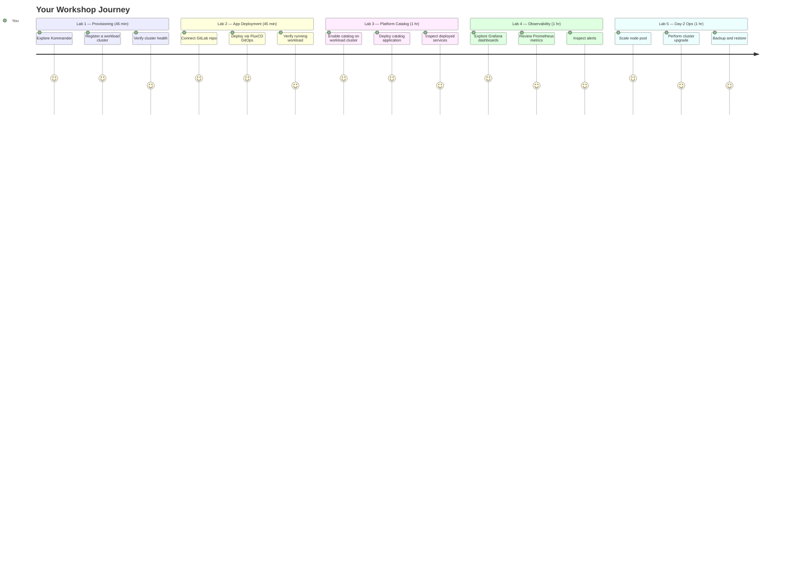

## Welcome to the BLS NKP Hands-On Workshop

This workshop gives you direct, hands-on experience operating **Nutanix Kubernetes Platform (NKP)**.
You will provision and manage workload clusters, deploy applications via GitOps, enable platform
services, observe infrastructure health, and run Day-2 operations — all through the NKP Kommander console.

---

## Agenda

| Lab | Topic | Duration |
|-----|-------|----------|
| Lab 1 | Workload Cluster Provisioning via NKP UI | 45 min |
| Lab 2 | Application Deployment via NKP + GitLab | 45 min |
| Lab 3 | Enable Platform Catalog | 1 hr |
| Lab 4 | Infrastructure Observability & Monitoring | 1 hr |
| Lab 5 | Production Operations (Day-2 Ops) | 1 hr |

**Total: ~4 hours 30 minutes**

---

## Environment

All labs run against a shared NKP environment:

- **Management cluster (Kommander):** `http://10.38.49.15`
- **Workload cluster:** `workload01` at `10.38.49.18`
- **kubeconfig:** `auth/workload01.conf` (pre-loaded in your session)

The management cluster (Kommander) is your control plane. From it you provision, observe,
and operate the `workload01` cluster throughout this workshop.

---

## How These Labs Work

These are **free-hand labs**. There is no automated checker — you navigate the NKP UI and CLI at your own pace.
Each lab page describes:

1. **What** you are doing and **why** it matters
2. **Step-by-step** navigation through the Kommander UI
3. **Verification commands** you can run to confirm the outcome
4. **Checkpoints** to confirm you are on track before moving on

Your facilitator is available throughout. Raise your hand any time.
