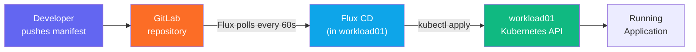

## Goal

Deploy an application to `workload01` using **FluxCD GitOps** — NKP's built-in continuous delivery
engine — connected to a GitLab repository. Any push to the repo will automatically reconcile
the cluster state.

---

## Background

NKP ships **Flux CD** as its native GitOps engine. Flux watches a Git repository and
continuously reconciles the cluster to match what is declared in that repo.



Two Flux resources drive this:

| Resource | Purpose |
|----------|---------|
| `GitRepository` | Points Flux at a Git repo (URL + credentials) |
| `Kustomization` | Tells Flux which path in that repo to apply, and to which cluster |

---

## Step 1 — Prepare a GitLab Repository

Your facilitator has a sample GitLab repository with a simple NGINX deployment manifest.
Get the repository URL and a **read-only personal access token** from your facilitator.

Example repository structure:
```
apps/
  nginx/
    namespace.yaml
    deployment.yaml
    service.yaml
```

---

## Step 2 — Create a Namespace on workload01

Open a terminal:

```bash
KUBECONFIG=/Git/Nutanix-NKP-Workshop/auth/workload01.conf \
  kubectl create namespace bls-app
```

---

## Step 3 — Create a GitLab Credentials Secret

Flux needs credentials to pull from a private GitLab repo. Create a secret in the
`flux-system` namespace on `workload01`:

```bash
KUBECONFIG=/Git/Nutanix-NKP-Workshop/auth/workload01.conf \
  kubectl create secret generic gitlab-credentials \
  --namespace flux-system \
  --from-literal=username=workshop-user \
  --from-literal=password=<your-personal-access-token>
```

> Replace `<your-personal-access-token>` with the token from your facilitator.

---

## Step 4 — Create a GitRepository Source

Create a `GitRepository` object that points Flux at the GitLab repo.

Save the following as `gitrepo.yaml`, then apply it:

```yaml
apiVersion: source.toolkit.fluxcd.io/v1
kind: GitRepository
metadata:
  name: bls-app-source
  namespace: flux-system
spec:
  interval: 1m0s
  url: https://gitlab.example.com/workshop/sample-app.git
  secretRef:
    name: gitlab-credentials
  ref:
    branch: main
```

```bash
KUBECONFIG=/Git/Nutanix-NKP-Workshop/auth/workload01.conf \
  kubectl apply -f gitrepo.yaml
```

Verify Flux can reach the repo:

```bash
KUBECONFIG=/Git/Nutanix-NKP-Workshop/auth/workload01.conf \
  kubectl get gitrepository -n flux-system bls-app-source
```

Expected: `READY=True`, `STATUS=stored artifact for revision 'main/...'`

---

## Step 5 — Create a Kustomization

Tell Flux which path to apply and to which namespace:

```yaml
apiVersion: kustomize.toolkit.fluxcd.io/v1
kind: Kustomization
metadata:
  name: bls-app
  namespace: flux-system
spec:
  interval: 5m0s
  path: ./apps/nginx
  prune: true
  sourceRef:
    kind: GitRepository
    name: bls-app-source
  targetNamespace: bls-app
```

```bash
KUBECONFIG=/Git/Nutanix-NKP-Workshop/auth/workload01.conf \
  kubectl apply -f kustomization.yaml
```

---

## Step 6 — Verify the Deployment

Within 1–2 minutes, Flux will reconcile the repository and deploy NGINX:

```bash
KUBECONFIG=/Git/Nutanix-NKP-Workshop/auth/workload01.conf \
  kubectl get kustomization -n flux-system bls-app
```

Expected: `READY=True`, `APPLIED REVISION=main/...`

Check the running pods:

```bash
KUBECONFIG=/Git/Nutanix-NKP-Workshop/auth/workload01.conf \
  kubectl get pods -n bls-app
```

Expected: `nginx-...` pod in `Running` state.

---

## Step 7 — View in Kommander UI

1. Open Kommander → **Clusters** → `workload01`.
2. Click **Workloads** (or **Applications**) in the sidebar.
3. Filter by namespace `bls-app` — you will see the NGINX deployment listed.
4. Click the deployment name to see replica status, pod health, and resource usage.

> **Checkpoint ✅** — NGINX pod is Running in `bls-app` namespace, visible in both CLI and Kommander UI.

---

## Step 8 — Trigger a GitOps Update

1. Edit a file in the GitLab repo (e.g., change the `replicas` count from `1` to `2`).
2. Commit and push to `main`.
3. Within 60 seconds, Flux detects the change and reconciles.
4. Watch the pods update:

```bash
KUBECONFIG=/Git/Nutanix-NKP-Workshop/auth/workload01.conf \
  kubectl get pods -n bls-app -w
```

> **Observe:** A second NGINX pod starts automatically — no manual `kubectl apply` needed.

---

## Summary

You connected NKP's built-in Flux CD to a GitLab repository and deployed an application
to `workload01` entirely via GitOps. Any change pushed to GitLab is automatically
reconciled to the cluster — this is the foundation of reliable, auditable deployments.
