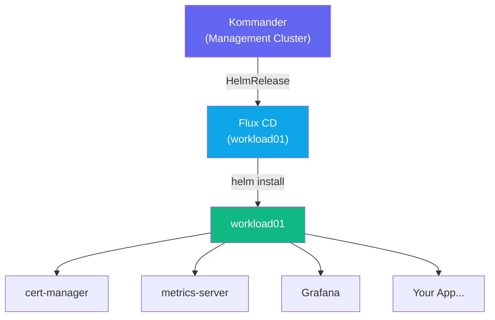

## Goal

Enable NKP's **Platform Application Catalog** on `workload01` and deploy a catalog application.
The catalog gives platform teams a curated set of Helm-packaged services (databases, observability
tools, ingress controllers, certificate managers) that any team can deploy with a few clicks.

---

## Background

The NKP catalog is driven by **HelmRepository** sources managed by Flux. When you enable a
catalog application on a workload cluster, Kommander instructs Flux to install the corresponding
Helm chart from the curated repository.



---

## Step 1 — Open the Catalog in Kommander

1. Log in to Kommander: `https://10.38.49.15`
2. In the left navigation, go to **Clusters** → click `workload01`.
3. In the cluster sidebar, click **Applications** (or **Add-ons / Catalog**).
4. You will see the catalog grid — all available platform applications.

> **Observe:** Each application card shows name, version, and current deployment status.
> Cards with a green indicator are already deployed. Grey cards are available to enable.

---

## Step 2 — Explore What Is Already Enabled

Many platform applications are pre-installed by NKP during cluster bootstrapping.
Check which ones are running:

```bash
KUBECONFIG=/Git/Nutanix-NKP-Workshop/auth/workload01.conf \
  kubectl get helmreleases -A
```

Common pre-installed apps:

| Application | Namespace | Purpose |
|-------------|-----------|---------|
| `cert-manager` | `cert-manager` | TLS certificate automation |
| `metrics-server` | `kube-system` | Resource metrics (CPU/memory) |
| `traefik` | `kommander-default-workspace` | Ingress controller |
| `prometheus` | `monitoring` | Metrics collection |

---

## Step 3 — Enable a Catalog Application

In this step you will enable **Grafana** on `workload01` via the Kommander UI.

1. In the catalog grid, find the **Grafana** card.
2. Click **Enable** (or the toggle).
3. A configuration drawer opens. Review the default values:
   - **Namespace:** `monitoring` (pre-filled)
   - **Helm values:** editable YAML for customization
4. Leave defaults as-is and click **Enable Application**.
5. Kommander creates a `HelmRelease` object on `workload01`. Flux installs the chart.

Monitor the rollout:

```bash
KUBECONFIG=/Git/Nutanix-NKP-Workshop/auth/workload01.conf \
  kubectl get pods -n monitoring -w
```

Wait until all Grafana pods reach `Running`.

> **Checkpoint ✅** — Grafana pod running in `monitoring` namespace.

---

## Step 4 — Inspect the HelmRelease

See how Kommander expressed the installation as a Flux resource:

```bash
KUBECONFIG=/Git/Nutanix-NKP-Workshop/auth/workload01.conf \
  kubectl get helmrelease grafana -n monitoring -o yaml
```

Key fields to note:
- `spec.chart.spec.chart` — the Helm chart name
- `spec.chart.spec.version` — the chart version being installed
- `spec.values` — the customization values Kommander passed

---

## Step 5 — Access Grafana

Get the Grafana service URL:

```bash
KUBECONFIG=/Git/Nutanix-NKP-Workshop/auth/workload01.conf \
  kubectl get svc -n monitoring | grep grafana
```

If Grafana has an ingress, get the URL:

```bash
KUBECONFIG=/Git/Nutanix-NKP-Workshop/auth/workload01.conf \
  kubectl get ingress -n monitoring
```

Open the URL in your browser. Default credentials are usually `admin / prom-operator`
(confirm with your facilitator — NKP may set a different default).

---

## Step 6 — Enable a Second Application: metrics-server

If `metrics-server` is not yet enabled, enable it from the catalog the same way:

1. Find the **metrics-server** card in the catalog.
2. Click **Enable** → leave defaults → **Enable Application**.
3. Verify `kubectl top nodes` works:

```bash
KUBECONFIG=/Git/Nutanix-NKP-Workshop/auth/workload01.conf \
  kubectl top nodes
```

Expected: CPU and memory usage shown for each node.

---

## Step 7 — Update a Catalog Application

The catalog supports in-place upgrades via Helm values changes.

1. In Kommander, click the **Grafana** card (now showing as enabled).
2. Click **Edit Configuration**.
3. Change a Helm value — for example, set `adminPassword: WorkshopAdmin2024`.
4. Click **Update**. Flux reconciles and Helm upgrades the release.
5. Watch the rollout:

```bash
KUBECONFIG=/Git/Nutanix-NKP-Workshop/auth/workload01.conf \
  kubectl rollout status deployment grafana -n monitoring
```

---

## Step 8 — Disable a Catalog Application

1. Find an application you enabled (e.g., a test deployment).
2. Click the enabled card → **Disable Application**.
3. Kommander removes the `HelmRelease`. Flux uninstalls the Helm chart.
4. Verify it is gone:

```bash
KUBECONFIG=/Git/Nutanix-NKP-Workshop/auth/workload01.conf \
  kubectl get helmreleases -A | grep <app-name>
```

> **Checkpoint ✅** — You have enabled, configured, and disabled catalog applications on `workload01` entirely from the Kommander UI.

---

## Summary

The NKP Platform Catalog gives operations teams a self-service way to provision infrastructure
services without writing Helm commands or managing chart repositories. The underlying engine is
Flux CD — every catalog change is a `HelmRelease` object, traceable and auditable in Git.
