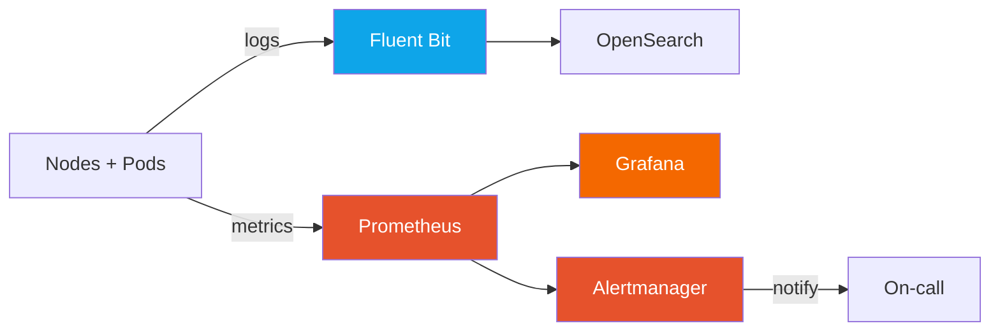

## Goal

Explore NKP's built-in observability stack on `workload01`. You will navigate Grafana dashboards,
query Prometheus metrics, and inspect Alertmanager rules — gaining visibility into cluster health
without installing any third-party tooling.

---

## Background

NKP ships a pre-integrated observability stack:

| Tool | Role |
|------|------|
| **Prometheus** | Scrapes metrics from all nodes, pods, and NKP components |
| **Grafana** | Visualizes metrics in pre-built and custom dashboards |
| **Alertmanager** | Routes and manages alerts from Prometheus rules |
| **Fluent Bit** | Collects container logs and forwards to OpenSearch |
| **OpenSearch** | Indexes and makes logs searchable |



---

## Step 1 — Confirm Monitoring Stack is Running

```bash
KUBECONFIG=/Git/Nutanix-NKP-Workshop/auth/workload01.conf \
  kubectl get pods -n monitoring
```

You should see pods for:
- `prometheus-...`
- `grafana-...`
- `alertmanager-...`
- `kube-state-metrics-...`
- `node-exporter-...` (one per node)

Check resource usage at a glance:

```bash
KUBECONFIG=/Git/Nutanix-NKP-Workshop/auth/workload01.conf \
  kubectl top nodes
```

---

## Step 2 — Open Grafana

Get the Grafana URL:

```bash
KUBECONFIG=/Git/Nutanix-NKP-Workshop/auth/workload01.conf \
  kubectl get ingress -n monitoring
```

Or access it via the Kommander UI:

1. Kommander → **Clusters** → `workload01` → **Applications**
2. Click the **Grafana** tile → **Open** (or the external link icon).

Log in with the admin credentials your facilitator provided.

---

## Step 3 — Explore Pre-Built Dashboards

1. In Grafana, click **Dashboards** in the left sidebar.
2. Open the **Kubernetes / Compute Resources / Cluster** dashboard.

**What to look for:**

| Panel | Meaning |
|-------|---------|
| CPU Usage by Namespace | Which workloads are consuming CPU |
| Memory Usage by Namespace | Which namespaces are approaching limits |
| Network Bytes Received/Transmitted | Traffic patterns across the cluster |
| Pod Restart Count | Pods that may be crashing or OOM-killing |

3. Open **Kubernetes / Compute Resources / Node (Pods)** — select a node from the dropdown.
4. Open **Kubernetes / USE Method / Cluster** — Utilization, Saturation, Errors for each resource.

> **Observe:** These dashboards are powered entirely by Prometheus scraping standard Kubernetes
> metrics — no custom instrumentation needed.

---

## Step 4 — Query Prometheus Directly

1. In Grafana, go to **Explore** (compass icon in the left sidebar).
2. Ensure the data source is set to **Prometheus**.
3. Run a few queries to understand the cluster:

**Node CPU usage (percentage):**
```promql
100 - (avg by (instance) (irate(node_cpu_seconds_total{mode="idle"}[5m])) * 100)
```

**Memory available per node (GB):**
```promql
node_memory_MemAvailable_bytes / 1024 / 1024 / 1024
```

**Number of running pods per node:**
```promql
count by (node) (kube_pod_info{node!=""})
```

**Pods not in Running state:**
```promql
kube_pod_status_phase{phase!="Running",phase!="Succeeded"} == 1
```

> **Checkpoint ✅** — You can run PromQL queries and read live cluster metrics.

---

## Step 5 — Explore Alertmanager

1. Get the Alertmanager URL:

```bash
KUBECONFIG=/Git/Nutanix-NKP-Workshop/auth/workload01.conf \
  kubectl get ingress -n monitoring | grep alertmanager
```

2. Open the URL. You will see any currently firing alerts.
3. Click **Alerts** in the navigation — browse the active alert rules.
4. Click any alert to see its **Labels**, **Annotations**, and **Source** (the PromQL expression that triggers it).

---

## Step 6 — Inspect Alert Rules

View the Prometheus alert rules loaded into the cluster:

```bash
KUBECONFIG=/Git/Nutanix-NKP-Workshop/auth/workload01.conf \
  kubectl get prometheusrule -A
```

Inspect a specific rule:

```bash
KUBECONFIG=/Git/Nutanix-NKP-Workshop/auth/workload01.conf \
  kubectl get prometheusrule -n monitoring kube-prometheus-stack-kubernetes-system \
  -o jsonpath='{.spec.groups[0].rules[0]}' | python3 -m json.tool
```

> **Observe:** Alert rules are Kubernetes resources — they can be versioned in Git and deployed
> via the same GitOps workflow used for applications.

---

## Step 7 — Create a Custom Dashboard Panel

In Grafana, add a panel to track your application namespace:

1. Click **Dashboards** → **New** → **New Dashboard** → **Add visualization**.
2. Select **Prometheus** as the data source.
3. Enter this query to track pod restarts in the `bls-app` namespace (from Lab 2):

```promql
sum(increase(kube_pod_container_status_restarts_total{namespace="bls-app"}[1h]))
```

4. Set the panel title to `bls-app Pod Restarts (1h)`.
5. Click **Apply** → **Save dashboard** → name it `BLS Workshop`.

---

## Step 8 — Review Node Exporter Metrics

Each cluster node runs a `node-exporter` daemonset that exposes host-level metrics.
View the node exporter pods:

```bash
KUBECONFIG=/Git/Nutanix-NKP-Workshop/auth/workload01.conf \
  kubectl get pods -n monitoring -l app.kubernetes.io/name=node-exporter
```

In Grafana, open **Node Exporter Full** dashboard and select any node from the dropdown.
Key metrics to review:
- Disk I/O read/write throughput
- Network interface errors
- System load (1m/5m/15m)
- Filesystem usage per mount point

> **Checkpoint ✅** — You have a custom dashboard saved in Grafana showing `bls-app` health,
> and have reviewed node-level metrics.

---

## Summary

NKP's observability stack provides full-stack visibility — from node hardware metrics through
application pods — out of the box. Prometheus, Grafana, and Alertmanager work together to give
operations teams real-time insight and proactive alerting without additional setup.
