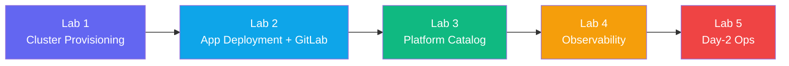

## Congratulations — Workshop Complete!

You have completed the BLS NKP Hands-On Workshop. In approximately 4.5 hours you worked through
the full lifecycle of a Kubernetes platform — from provisioning to production operations.

---

## What You Accomplished

| Lab | What you did |
|-----|-------------|
| **Lab 1** | Explored Kommander cluster management, registered `workload01` as a managed cluster |
| **Lab 2** | Deployed an application via FluxCD GitOps connected to GitLab — saw a live GitOps update |
| **Lab 3** | Enabled platform catalog applications on `workload01` via Kommander, managed lifecycle |
| **Lab 4** | Explored Grafana dashboards, queried Prometheus, reviewed Alertmanager rules, created a custom panel |
| **Lab 5** | Scaled node pools, performed a Kubernetes upgrade, backed up and restored a namespace, practised troubleshooting |

---

## Key NKP Concepts Reinforced

**Kommander is the single pane of glass.** All five labs operated through the same console.
You never needed to SSH into nodes or manage multiple kubeconfigs manually.

**GitOps is the deployment primitive.** Lab 2 showed that once Flux is connected to GitLab,
deployments become Git commits. This applies to applications AND platform components.

**The catalog eliminates toil.** Installing Grafana, cert-manager, or any catalog app is a
single click. Helm complexity is abstracted away and managed centrally.

**Observability is built in.** You did not install Prometheus or Grafana — they were there,
pre-configured and pre-wired to every workload.

**Day-2 ops are declarative.** Scaling and upgrades are state changes you declare; NKP
converges to them safely using CAPI's rolling replacement model.

---

## Next Steps

| Topic | Where to go |
|-------|-------------|
| NKP documentation | `docs.nutanix.com` → NKP section |
| Flux CD (GitOps) | `fluxcd.io/docs` |
| Cluster API | `cluster-api.sigs.k8s.io` |
| Velero (backup) | `velero.io/docs` |
| Prometheus + Grafana | `prometheus.io` / `grafana.com/docs` |

---

## Feedback

Please share your experience with your facilitator. Your feedback directly shapes future sessions.

Thank you for participating in the BLS NKP Hands-On Workshop.
