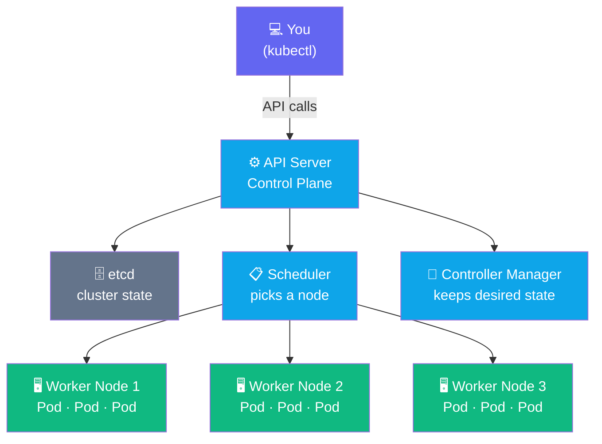
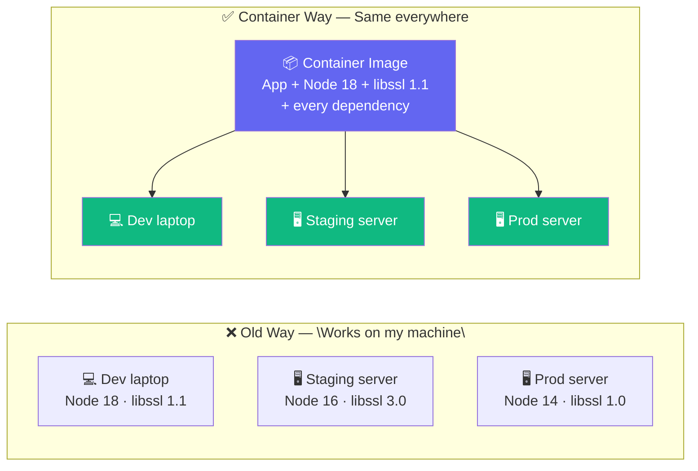

## What is Kubernetes?

Kubernetes is a platform that decides **where** your containers run, keeps them running, and
connects them to the network — automatically.



**You** describe what you want. **Kubernetes** figures out how to make it happen.

---

## What is a Container?

Before Kubernetes, running an app on a new server was painful. You had to install the right
version of Node, Python, or Java, configure libraries, set environment variables, and hope the
server matched your laptop. It rarely did.



A **container image** bundles your app and every dependency it needs into one sealed package.
Run that image anywhere — laptop, cloud, edge — and you get identical behaviour.

Think of it like a **shipping container**: the same box works on a truck, a train, and a ship
because the interface is standardised. The contents never change in transit.

---

## What You Will Build

By the end of this workshop you will have deployed a real application and understand exactly what
Kubernetes did behind the scenes at each step.

| Exercise | You Will… | Concept |
|----------|-----------|---------|
| 01 | Connect to a live cluster | kubeconfig, context |
| 02 | Inspect nodes and the control plane | Nodes, roles, capacity |
| 03 | Run your first container | Pods, exec, logs |
| 04 | Keep it running automatically | Deployments, ReplicaSets |
| 05 | Expose it to the network | Services, ClusterIP |
| 06 | Organise resources | Namespaces, labels |

---

## How This Workshop Works

Each exercise follows the same three-step pattern:

> **▶ Run** — Execute a command in the terminal on the right
>
> **👁 Observe** — Read what Kubernetes tells you and why it matters
>
> **✅ Checkpoint** — Confirm your understanding before moving on

Commands in boxes like this are **clickable** — click them and they run automatically.

```terminal:execute
command: echo "Your cluster is ready. Let's go."
```
