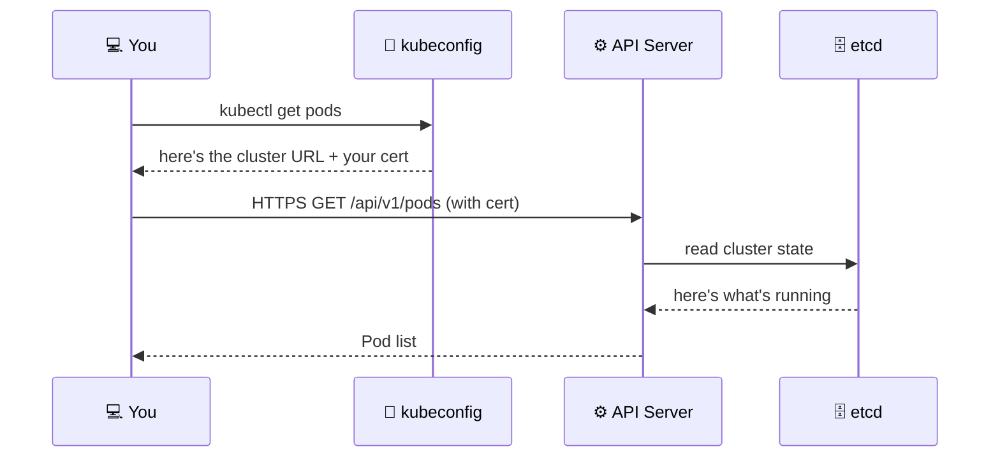

## How kubectl Talks to Kubernetes

Every `kubectl` command is an HTTPS API call. Before you can make that call, kubectl needs to
know three things: **where** the cluster is, **who** you are, and **which namespace** you're
working in. All of this lives in a file called a **kubeconfig**.



---

## Exercise 1.1 — Check Your Context

A **context** is a named combination of cluster + user + namespace. You can have many contexts
for different clusters and switch between them instantly.

```terminal:execute
command: kubectl config get-contexts
```

**👁 Observe:** The row with `*` is active. Note the cluster name — that's the NKP cluster you'll
use throughout this workshop.

---

## Exercise 1.2 — Inspect the kubeconfig

```terminal:execute
command: kubectl config view --minify
```

**👁 Observe:** Three key fields:
- `server:` — the API server URL (HTTPS)
- `certificate-authority-data:` — the cluster's TLS cert (you trust this CA)
- `user:` — your identity credentials

---

## Exercise 1.3 — Confirm API Server is Reachable

```terminal:execute
command: kubectl cluster-info
```

**👁 Observe:** You'll see the API server URL and CoreDNS endpoint. If this command returns
without error, your credentials are valid and the cluster is healthy.

---

## Exercise 1.4 — Check Your Permissions

```terminal:execute
command: kubectl auth whoami
```

```terminal:execute
command: kubectl auth can-i get pods
```

**👁 Observe:** `yes` means your service account is authorised. Kubernetes uses **RBAC**
(Role-Based Access Control) — every action is checked against a policy before it's allowed.

---

## ✅ Checkpoint

```examiner:execute-test
name: lab-01-context
title: "kubectl is connected and can reach the API server"
autostart: true
timeout: 15
command: kubectl cluster-info &>/dev/null && echo "PASS" || echo "FAIL"
```

> **What just happened?**
> You authenticated to a live Kubernetes cluster using a kubeconfig. `kubectl` translated your
> commands into API calls, the API server validated your identity, and returned cluster data.
> Every action in this workshop follows that same path.
