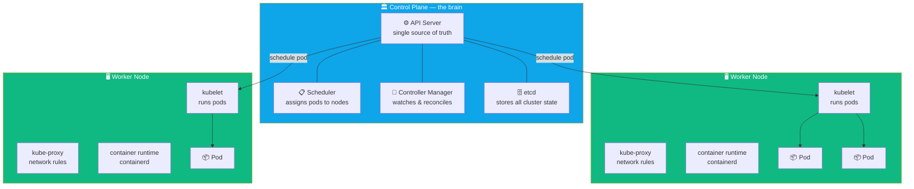

## The Two Kinds of Nodes

A Kubernetes cluster has two types of machines. They have completely different jobs.



| Component | Lives on | Does what |
|-----------|----------|-----------|
| API Server | Control plane | All reads and writes go through here |
| etcd | Control plane | Stores everything — like a database for cluster state |
| Scheduler | Control plane | Picks which node a new Pod runs on |
| Controller Manager | Control plane | Watches state, fixes drift |
| kubelet | Worker node | Receives pod specs, tells container runtime to start them |
| kube-proxy | Worker node | Programs network rules so services work |

---

## Exercise 2.1 — List All Nodes

```terminal:execute
command: kubectl get nodes -o wide
```

**👁 Observe:**
- `ROLES` — `control-plane` nodes run the brain; plain workers run your apps
- `STATUS` — must be `Ready` for pods to schedule there
- `VERSION` — the kubelet version; all should match

---

## Exercise 2.2 — Inspect One Node

Pick a worker node from the list above. Describe it to see its full spec:

```terminal:execute
command: kubectl describe node $(kubectl get nodes --no-headers -l '!node-role.kubernetes.io/control-plane' | head -1 | awk '{print $1}')
```

**👁 Observe these sections:**

**Capacity vs Allocatable**
```
Capacity:
  cpu:     8        ← total hardware
  memory:  32Gi
Allocatable:
  cpu:     7800m    ← what pods can actually use (OS overhead reserved)
  memory:  30Gi
```

**Conditions** — `Ready=True` means kubelet is healthy and the node can accept pods.

**Allocated resources** — how much CPU/memory is already claimed by running pods.

---

## Exercise 2.3 — See the Node's Pods

```terminal:execute
command: kubectl get pods --all-namespaces --field-selector spec.nodeName=$(kubectl get nodes --no-headers -l '!node-role.kubernetes.io/control-plane' | head -1 | awk '{print $1}')
```

**👁 Observe:** System pods like `kube-proxy` and `coredns` run on every node. They're the
infrastructure that makes your workloads work.

---

## ✅ Checkpoint

```examiner:execute-test
name: lab-02-nodes
title: "At least one worker node is Ready"
autostart: true
timeout: 15
command: |
  kubectl get nodes --no-headers | grep -v control-plane | grep -c "Ready" | grep -q "^[1-9]" && echo "PASS" || echo "FAIL"
```

> **What just happened?**
> You looked at the physical (and virtual) machines that form your cluster. The control plane
> nodes run the management software; worker nodes run your application containers. Kubernetes
> continuously monitors all of them and reschedules pods if a node goes unhealthy.
