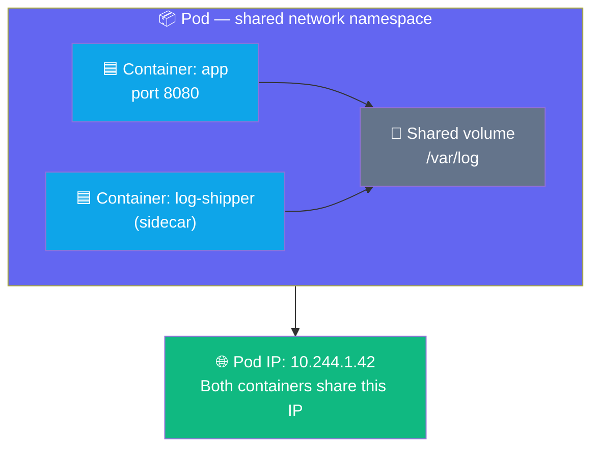
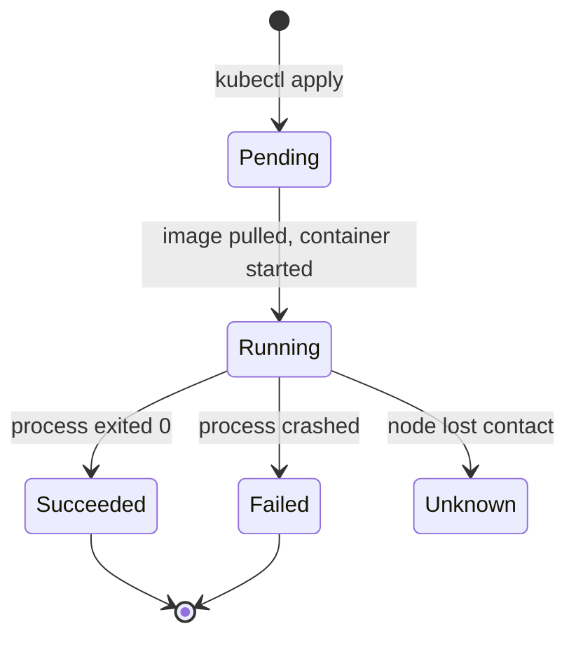

## What is a Pod?

A Pod is the smallest thing Kubernetes can schedule. It wraps one or more containers and gives
them a shared network and storage space.



The two containers in a Pod can talk to each other on `localhost` and share the same files.
From the outside, the Pod looks like a single machine with one IP address.

---

## Pod Lifecycle

A Pod moves through a defined set of phases:



---

## Exercise 3.1 — Run Your First Pod

```terminal:execute
command: kubectl run my-pod --image=nginx:alpine --restart=Never
```

Watch it start up:

```terminal:execute
command: kubectl get pod my-pod -w
```

Press `Ctrl+C` once it shows `Running`, then continue.

**👁 Observe the phases:** `Pending` (image pulling) → `ContainerCreating` → `Running`.

---

## Exercise 3.2 — Inspect the Pod

```terminal:execute
command: kubectl describe pod my-pod
```

**👁 Focus on these sections:**

- **Node:** — which worker node Kubernetes chose
- **IP:** — the Pod's private cluster IP
- **Image:** — the exact image pulled (with digest)
- **Events:** — the timeline of what happened (pull → create → start)

---

## Exercise 3.3 — Get Logs

The nginx container writes access logs to stdout. Kubernetes captures them automatically:

```terminal:execute
command: kubectl logs my-pod
```

**👁 Observe:** Logs come from stdout/stderr of the container. You don't need to SSH into
anything — Kubernetes captures and stores them for you.

---

## Exercise 3.4 — Run a Command Inside the Container

```terminal:execute
command: kubectl exec -it my-pod -- sh
```

You're now inside the container. Explore:

```terminal:execute
command: hostname && ip addr show eth0 | grep inet
```

```terminal:execute
command: cat /etc/os-release
```

```terminal:execute
command: exit
```

**👁 Observe:** The hostname is the Pod name. The IP matches what `describe` showed. The OS is
Alpine Linux — what the image was built from — not the host node's OS.

This is the power of containers: **the environment inside is completely isolated from the host**.

---

## Exercise 3.5 — Delete the Pod

Kubernetes does not automatically restart pods created with `--restart=Never`:

```terminal:execute
command: kubectl delete pod my-pod
```

```terminal:execute
command: kubectl get pods
```

**👁 Observe:** It's gone. No automatic recovery. That's intentional for one-off tasks.
In the next exercise you'll learn how to make pods **self-healing**.

---

## ✅ Checkpoint

```examiner:execute-test
name: lab-03-pod-deleted
title: "my-pod has been deleted"
autostart: true
timeout: 15
command: kubectl get pod my-pod &>/dev/null && echo "FAIL" || echo "PASS"
```

> **What just happened?**
> You ran a container on a real Kubernetes cluster. The scheduler picked a node, the kubelet
> pulled the image and started the container, and Kubernetes gave it a unique IP and captured
> its logs. You inspected it, shelled into it, and deleted it — all without touching a server.
