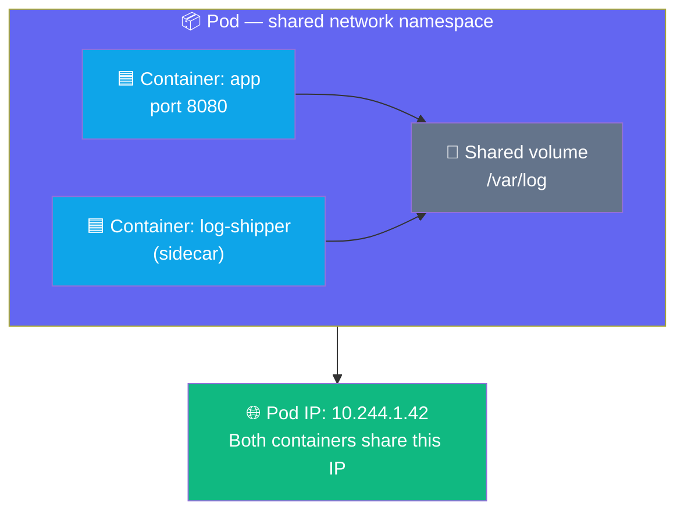
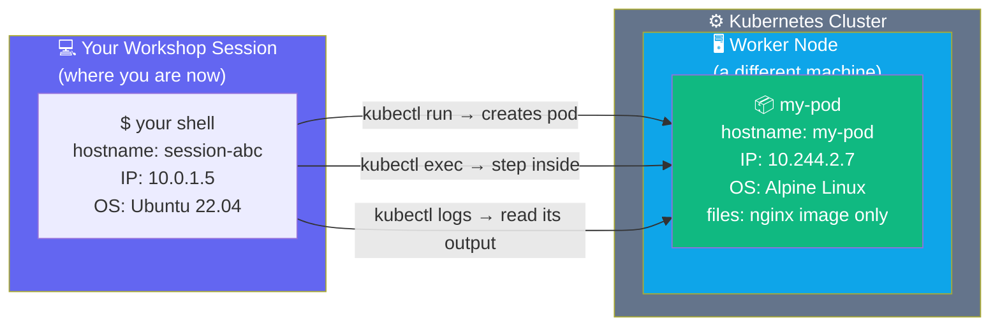
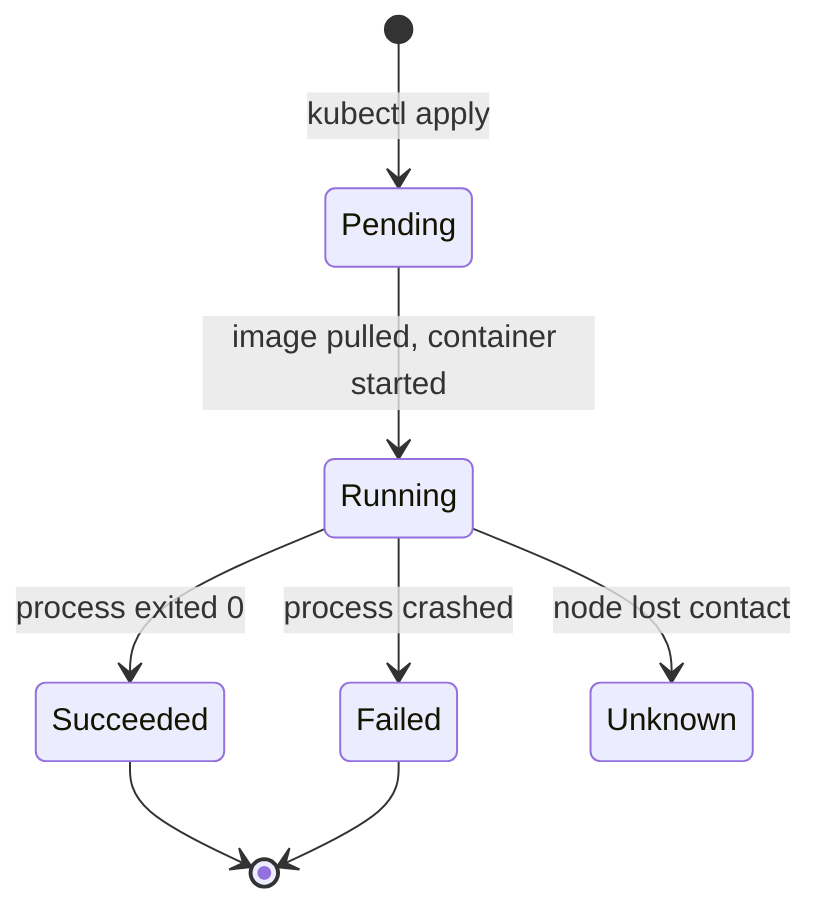

## What is a Pod?

A Pod is the smallest thing Kubernetes can schedule. It wraps one or more containers and gives
them a shared network and storage space.



The two containers in a Pod can talk to each other on `localhost` and share the same files.
From the outside, the Pod looks like a single machine with one IP address.

---

## A Pod is a Separate World

This is the most important thing to understand before running your first pod.

**Right now**, you are running commands inside your workshop session — a Linux environment with
its own hostname, its own IP, its own filesystem, its own OS packages.

**When a pod starts**, Kubernetes creates a completely separate environment on one of the cluster's
worker nodes. It has its own hostname, its own IP, its own filesystem. It cannot see your files.
You cannot reach it directly. It is isolated.



`kubectl` is the bridge. Without it, you and the pod are two separate, isolated worlds.

---

## Pod Lifecycle

A Pod moves through a defined set of phases:



---

## Exercise 3.1 — Run Your First Pod

```terminal:execute
command: kubectl run my-pod --image=nginx:alpine --restart=Never
```

Watch it start up:

```terminal:execute
command: kubectl get pod my-pod -w
```

Press `Ctrl+C` once it shows `Running`, then continue.

**👁 Observe the phases:** `Pending` (image pulling) → `ContainerCreating` → `Running`.

---

## Exercise 3.2 — Inspect the Pod

```terminal:execute
command: kubectl describe pod my-pod
```

**👁 Focus on these sections:**

- **Node:** — which worker node Kubernetes chose (a different machine from your session)
- **IP:** — the Pod's private cluster IP (different from yours)
- **Image:** — the exact image pulled (with digest)
- **Events:** — the timeline of what happened (pull → create → start)

---

## Exercise 3.3 — Get Logs

The nginx container writes access logs to stdout. Kubernetes captures them automatically:

```terminal:execute
command: kubectl logs my-pod
```

**👁 Observe:** Logs come from stdout/stderr of the container. You don't need to SSH into
anything — Kubernetes captures and stores them for you.

---

## Exercise 3.4 — Cross the Boundary

This exercise makes the isolation tangible. You will run the same three commands **in your
current environment** and then **inside the pod** — and see completely different answers.

**First — check where you are right now:**

```terminal:execute
command: echo "=== YOUR ENVIRONMENT ===" && hostname && ip route get 1 | awk '{print "IP:", $7; exit}' && cat /etc/os-release | grep PRETTY
```

Note your hostname, IP, and OS. These are properties of your workshop session.

---

**Now — step into the pod:**

```terminal:execute
command: kubectl exec -it my-pod -- sh
```

Your prompt changes. You have crossed into a different environment running on a different machine
in the cluster. Run the same three checks:

```terminal:execute
command: echo "=== INSIDE THE POD ===" && hostname && ip addr show eth0 | grep "inet " && cat /etc/os-release | grep PRETTY
```

**👁 Compare what you see:**

| | Your Session | Inside the Pod |
|--|-------------|----------------|
| **Hostname** | your session name | `my-pod` |
| **IP address** | your node's IP | a cluster-internal IP (10.244.x.x) |
| **OS** | Ubuntu / your host OS | Alpine Linux (from the image) |
| **Filesystem** | your workshop files | only what nginx:alpine ships |

The pod cannot see your files. You cannot ping the pod's IP from outside the cluster.
They are isolated worlds — connected only through `kubectl`.

Exit the pod and return to your session:

```terminal:execute
command: exit
```

**👁 Confirm you're back:** Run `hostname` again — you should see your session hostname, not `my-pod`.

```terminal:execute
command: hostname
```

---

## Exercise 3.5 — Delete the Pod

Kubernetes does not automatically restart pods created with `--restart=Never`:

```terminal:execute
command: kubectl delete pod my-pod
```

```terminal:execute
command: kubectl get pods
```

**👁 Observe:** It's gone. No automatic recovery. That's intentional for one-off tasks.
In the next exercise you'll learn how to make pods **self-healing**.

---

## ✅ Checkpoint

```examiner:execute-test
name: lab-03-pod-deleted
title: "my-pod has been deleted"
autostart: true
timeout: 15
command: kubectl get pod my-pod &>/dev/null && echo "FAIL" || echo "PASS"
```

> **What just happened?**
> You ran a container on a real Kubernetes cluster. The scheduler picked a node, the kubelet
> pulled the image and started the container, and Kubernetes gave it a unique IP and captured
> its logs. You stepped inside it with `kubectl exec` — crossing from your environment into a
> completely separate one with a different hostname, IP, OS, and filesystem. Then you stepped
> back out and deleted it — all without touching a server.
