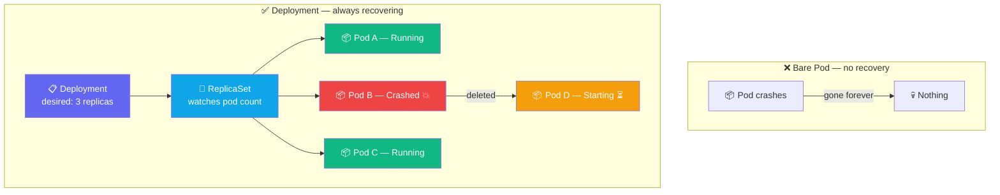

## The Problem with Bare Pods

In the last exercise, deleting the Pod made it disappear forever. Real applications need to
**stay running** even when a container crashes or a node goes down.



A **Deployment** declares the *desired state*. A **ReplicaSet** continuously watches the
actual state and creates or deletes Pods to match. This is Kubernetes' core loop: **reconciliation**.

---

## Exercise 4.1 — Create a Deployment

```terminal:execute
command: kubectl create deployment web --image=nginx:alpine --replicas=3
```

```terminal:execute
command: kubectl get deployment web
```

```terminal:execute
command: kubectl get replicaset
```

```terminal:execute
command: kubectl get pods -l app=web
```

**👁 Observe the hierarchy:** Deployment → ReplicaSet → 3 Pods. Each Pod has a generated name
like `web-7d9f8c-xz4k2` — the middle hash is the ReplicaSet, the last part is the Pod.

---

## Exercise 4.2 — Prove Self-Healing

Delete one Pod and watch Kubernetes replace it immediately:

```terminal:execute
command: kubectl delete pod $(kubectl get pods -l app=web --no-headers | head -1 | awk '{print $1}')
```

```terminal:execute
command: kubectl get pods -l app=web
```

**👁 Observe:** A new Pod appears within seconds. The ReplicaSet noticed the count dropped from
3 to 2, and immediately created a replacement. You didn't do anything — Kubernetes fixed it.

---

## Exercise 4.3 — Scale Up and Down

```terminal:execute
command: kubectl scale deployment web --replicas=5
```

```terminal:execute
command: kubectl get pods -l app=web
```

```terminal:execute
command: kubectl scale deployment web --replicas=2
```

```terminal:execute
command: kubectl get pods -l app=web
```

**👁 Observe:** Scaling up creates pods immediately. Scaling down terminates the excess pods
gracefully. The Deployment tracks the new desired state.

---

## Exercise 4.4 — Roll Out a New Version

Update the image to a newer nginx version:

```terminal:execute
command: kubectl set image deployment/web nginx=nginx:1.27-alpine
```

Watch the rollout happen live:

```terminal:execute
command: kubectl rollout status deployment/web
```

```terminal:execute
command: kubectl get pods -l app=web
```

**👁 Observe:** Kubernetes replaces Pods one at a time (rolling update). Your app stays available
throughout — some pods run the old version, some the new, until the transition is complete.

---

## Exercise 4.5 — Roll Back

If a rollout goes wrong, you can revert instantly:

```terminal:execute
command: kubectl rollout undo deployment/web
```

```terminal:execute
command: kubectl rollout status deployment/web
```

**👁 Observe:** Kubernetes reverts to the previous ReplicaSet. The old pods come back up and
the new pods are removed — same rolling process, just in reverse.

---

## ✅ Checkpoint

```examiner:execute-test
name: lab-04-deployment
title: "web Deployment has 2 ready replicas"
autostart: true
timeout: 30
command: |
  READY=$(kubectl get deployment web -o jsonpath='{.status.readyReplicas}' 2>/dev/null)
  [ "$READY" = "2" ] && echo "PASS" || echo "FAIL (got $READY)"
```

> **What just happened?**
> You replaced fragile bare pods with a Deployment. Now Kubernetes watches your desired state
> (2 replicas) and continuously reconciles reality to match it — whether a pod crashes, a node
> goes down, or you deliberately scale. This reconciliation loop is the foundation of everything
> Kubernetes does.
