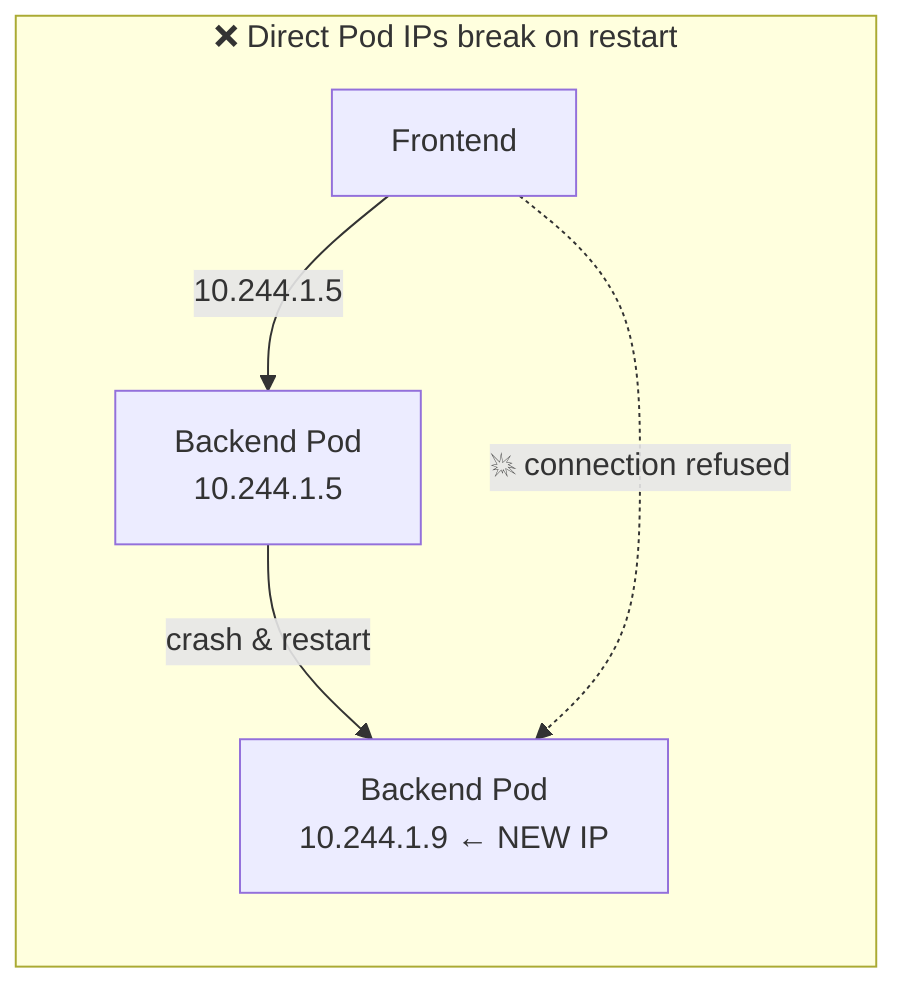
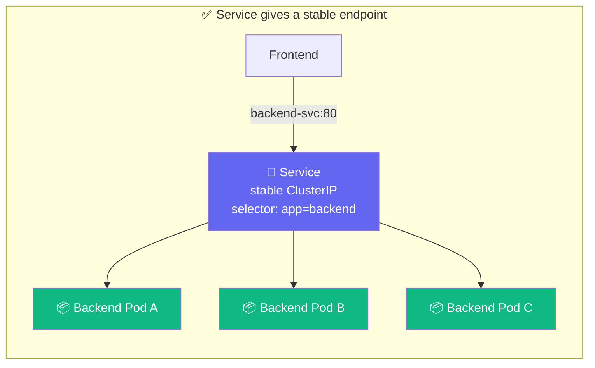
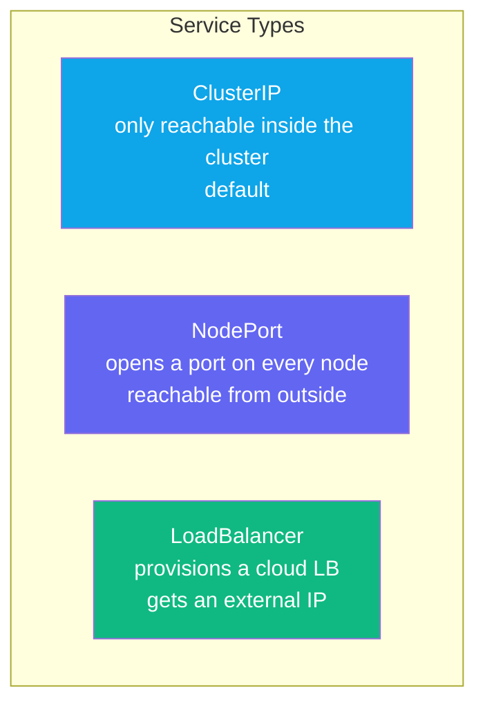

## The Problem with Pod IPs

Pods are ephemeral. Every time one restarts it gets a **new IP address**. If your frontend
hardcoded the backend's IP, it would break every time a pod restarted.





A **Service** uses a **label selector** to find Pods and load-balance traffic across them.
Pods come and go — the Service IP and DNS name stay constant.

---

## Service Types



---

## Exercise 5.1 — Expose the Deployment

```terminal:execute
command: kubectl expose deployment web --port=80 --target-port=80 --name=web-svc
```

```terminal:execute
command: kubectl get service web-svc
```

**👁 Observe:** The Service gets a stable `CLUSTER-IP`. This IP never changes, even when the
pods behind it are replaced.

---

## Exercise 5.2 — Inspect the Endpoints

A Service tracks its target Pods as **Endpoints**:

```terminal:execute
command: kubectl get endpoints web-svc
```

**👁 Observe:** Each Pod IP appears in the endpoints list. Add or remove pods and this list
updates automatically.

---

## Exercise 5.3 — Call the Service from Inside the Cluster

Launch a temporary pod and curl the service by its DNS name:

```terminal:execute
command: kubectl run curl-test --image=curlimages/curl:latest --restart=Never --rm -it -- curl http://web-svc
```

**👁 Observe:** You used the service name `web-svc` as a hostname. Kubernetes DNS resolved it
to the ClusterIP, which load-balanced to one of the nginx pods. DNS + Services = the standard
way services find each other inside a cluster.

---

## Exercise 5.4 — Label Selectors Drive Everything

Services find their pods via labels. Break it to understand it:

```terminal:execute
command: kubectl get pods -l app=web --show-labels
```

Change the label on one pod so the Service stops sending it traffic:

```terminal:execute
command: kubectl label pod $(kubectl get pods -l app=web --no-headers | head -1 | awk '{print $1}') app=web-isolated --overwrite
```

```terminal:execute
command: kubectl get endpoints web-svc
```

**👁 Observe:** That pod's IP is no longer in the endpoints list. The Service immediately
stopped routing traffic to it — no restart, no config change.

Restore it:

```terminal:execute
command: kubectl label pod $(kubectl get pods -l app=web-isolated --no-headers | head -1 | awk '{print $1}') app=web --overwrite
```

---

## ✅ Checkpoint

```examiner:execute-test
name: lab-05-service
title: "web-svc Service exists and has endpoints"
autostart: true
timeout: 15
command: |
  EP=$(kubectl get endpoints web-svc -o jsonpath='{.subsets[0].addresses}' 2>/dev/null)
  [ -n "$EP" ] && echo "PASS" || echo "FAIL"
```

> **What just happened?**
> You decoupled your application from its pod IPs. The Service provides a stable virtual IP
> and DNS name, and uses label selectors to find healthy pods at runtime. This is how every
> microservice finds every other microservice inside a Kubernetes cluster.
