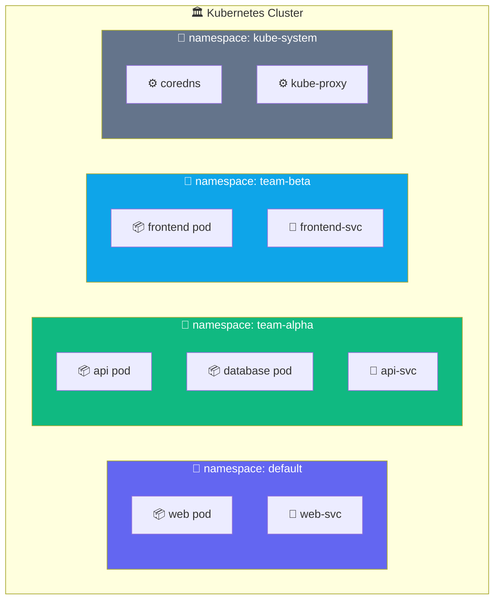

## What is a Namespace?

A namespace is a virtual partition inside a single cluster. Teams, projects, or environments
each get their own namespace — they share the same physical nodes but can't accidentally
touch each other's resources.



Resource names only need to be unique **within** a namespace. You can have a pod called `api`
in both `team-alpha` and `team-beta` with no conflict.

---

## Exercise 6.1 — List Namespaces

```terminal:execute
command: kubectl get namespaces
```

**👁 Observe:**
- `default` — where resources go if you don't specify a namespace
- `kube-system` — Kubernetes' own infrastructure (DNS, proxy, etc.)
- `kube-public` — world-readable data (cluster info)
- Your session namespace (starts with `nkp-workshop-portal`)

---

## Exercise 6.2 — Create Your Own Namespace

```terminal:execute
command: kubectl create namespace my-app
```

```terminal:execute
command: kubectl get namespace my-app
```

---

## Exercise 6.3 — Deploy into a Specific Namespace

```terminal:execute
command: kubectl create deployment hello --image=nginx:alpine --namespace=my-app
```

```terminal:execute
command: kubectl get pods --namespace=my-app
```

```terminal:execute
command: kubectl get pods
```

**👁 Observe:** The second command (no `--namespace`) shows nothing — `hello` is invisible
from the `default` namespace. They're isolated by default.

---

## Exercise 6.4 — Cross-Namespace DNS

Services in one namespace can reach services in another using the full DNS name:
`<service>.<namespace>.svc.cluster.local`

```terminal:execute
command: kubectl expose deployment hello --port=80 --namespace=my-app
```

```terminal:execute
command: kubectl run dns-test --image=curlimages/curl:latest --restart=Never --rm -it -- curl http://hello.my-app.svc.cluster.local
```

**👁 Observe:** The request succeeded across namespace boundaries using DNS. Within a namespace
you use just the service name. Cross-namespace you use the full DNS path.

---

## Exercise 6.5 — Labels & Selectors

Labels are key-value pairs you attach to any resource. Selectors find resources by label.
They're how Services find Pods, how Deployments track ReplicaSets, how you filter `kubectl` output.

```terminal:execute
command: kubectl get pods --all-namespaces -l app=hello
```

```terminal:execute
command: kubectl label namespace my-app environment=workshop team=demo
```

```terminal:execute
command: kubectl get namespace my-app --show-labels
```

**👁 Observe:** Labels are free-form metadata — you define what they mean. Tools like network
policies, cost allocation, and GitOps pipelines all use labels to target resources.

---

## Exercise 6.6 — Clean Up

```terminal:execute
command: kubectl delete namespace my-app
```

**👁 Observe:** Deleting a namespace deletes **everything** inside it — pods, services,
configmaps, all of it. Namespaces are the natural unit of cleanup.

---

## ✅ Checkpoint

```examiner:execute-test
name: lab-06-namespaces
title: "my-app namespace has been deleted"
autostart: true
timeout: 15
command: kubectl get namespace my-app &>/dev/null && echo "FAIL" || echo "PASS"
```

> **What just happened?**
> You used namespaces to create isolated environments inside a shared cluster, deployed into
> them independently, and discovered that full DNS paths allow controlled cross-namespace
> communication. In production, namespaces map to teams, services, or environments —
> with RBAC and network policies controlling who can see and talk to what.
