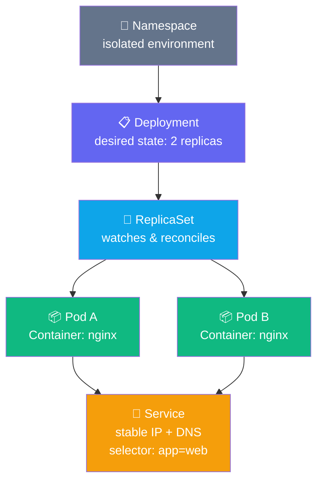
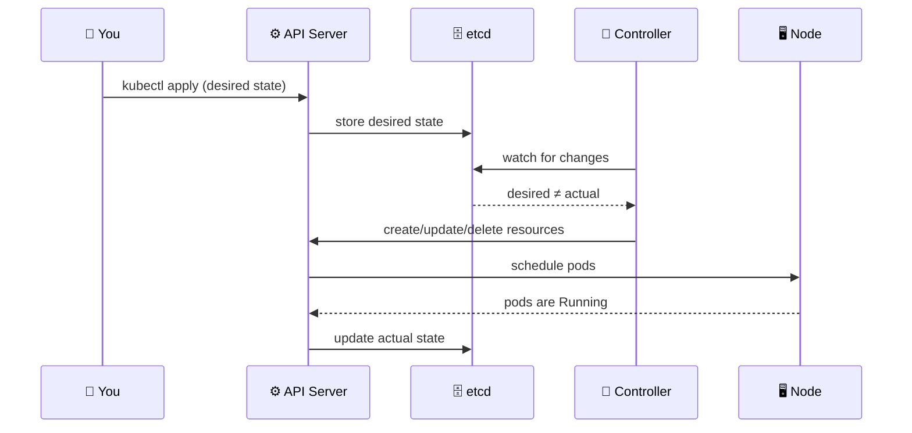

## What You Built

You went from zero to a running, self-healing, network-accessible application on a real
Kubernetes cluster — understanding every layer of the stack as you went.

---

## Concepts Covered

| Concept | What it does | Why it matters |
|---------|-------------|----------------|
| **Container** | Packages app + all dependencies into one image | Identical behaviour on every machine |
| **Pod** | Wraps one or more containers with shared network/storage | Smallest schedulable unit |
| **Deployment** | Declares desired replica count and image | Self-healing, rolling updates, rollback |
| **ReplicaSet** | Watches pod count, creates/deletes to match desired | The reconciliation engine |
| **Service** | Stable IP + DNS over a set of pods | Decouples consumers from pod churn |
| **Namespace** | Virtual partition of the cluster | Isolation between teams/environments |
| **Label / Selector** | Key-value metadata + query | How every object finds every other object |

---

## The Core Loop — Commit This to Memory

You declare **what** you want. Kubernetes works out **how** to get there and keeps it there.

---

## What's Next

You now have the foundations. The next workshop — **NKP Platform** — builds on everything
here and shows you how real production workloads are deployed, observed, and operated on
Nutanix Kubernetes Platform.

| Next Topic | What You'll Add |
|------------|----------------|
| GitOps | Declarative deployments from Git via ArgoCD |
| Observability | Service mesh topology, distributed tracing, dashboards |
| Storage | Persistent volumes, snapshots, restore |
| Progressive delivery | Canary rollouts, traffic splitting, rollback |
