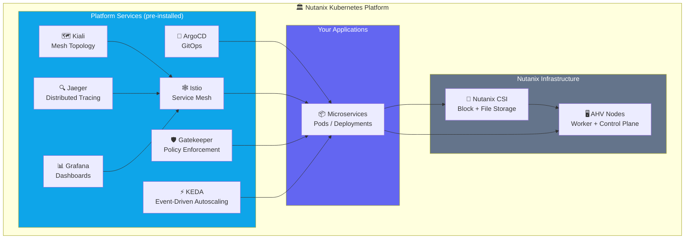
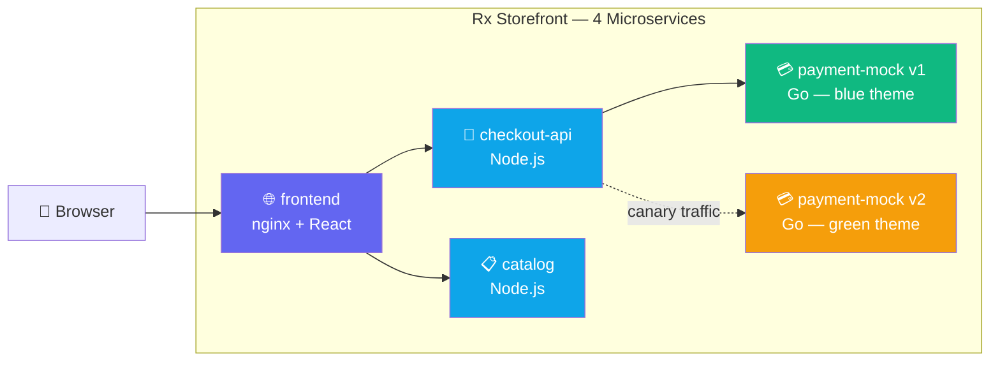
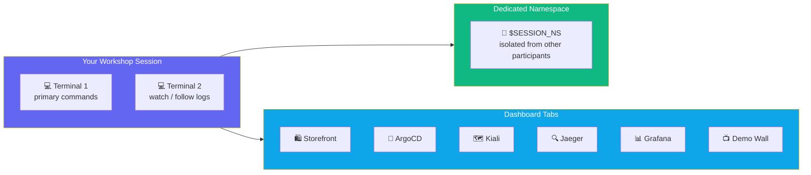

## What is NKP?

Nutanix Kubernetes Platform (NKP) is an enterprise Kubernetes distribution that packages everything
a production platform team needs: GitOps, observability, service mesh, storage, autoscaling, and
governance — all integrated and pre-configured on top of Kubernetes.



---

## What You'll Build

The **Rx Storefront** — a 4-service microservices application that exercises every platform capability:



By the end of this workshop you will have deployed this application, observed its traffic live, rolled
out v2 as a canary, backed up its database, tested resilience under node failure, and locked it down
with quota and policy governance.

---

## Workshop Map

| Lab | Topic | What You'll Do |
|-----|-------|----------------|
| **Lab 1** | Application Deployment | Deploy storefront via GitOps; see live mesh topology |
| **Lab 2** | Observability | Trace requests in Jaeger; correlate logs by trace ID |
| **Lab 3** | GitOps & Progressive Delivery | Mirror → 10% canary → 100% cutover → one-command rollback |
| **Lab 4** | Storage & Stateful Workloads | PostgreSQL + Nutanix CSI; snapshot → restore |
| **Lab 5** | Production Operations | Inject & diagnose incidents; drain a node; KEDA scale-from-zero |
| **Lab 6** | Multi-Tenancy & Governance | Quota pressure; Gatekeeper audit → deny; RBAC role separation |

---

## Your Session Environment



All platform dashboards share **one login**. Log in once — your browser session covers all tabs.

---

## Platform Credentials

```bash
_NS=${SESSION_NS%-s*}
echo "Username: $(kubectl get secret dkp-workshop-credentials -n $_NS -o jsonpath='{.data.username}' | base64 -d)"
echo "Password: $(kubectl get secret dkp-workshop-credentials -n $_NS -o jsonpath='{.data.password}' | base64 -d)"
```

---

## Session Ready Check

Verify your cluster access:

```bash
kubectl get nodes
```

```bash
echo "Your namespace: $SESSION_NS"
```

**👁 Observe:** 3+ Ready nodes = you're good to go. Each node is an AHV VM managed by Nutanix.

When you see all nodes Ready, click **Start Lab 1**.
