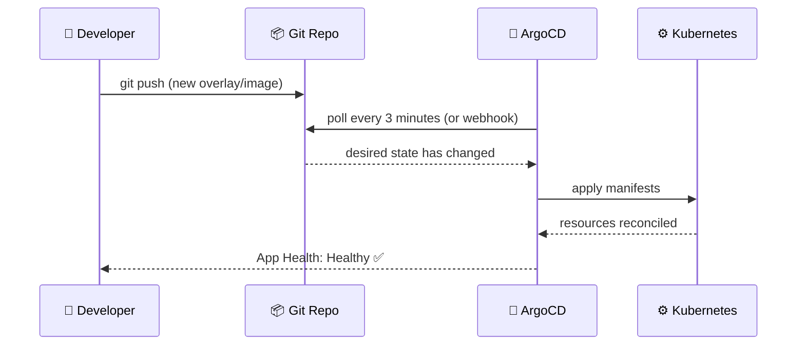
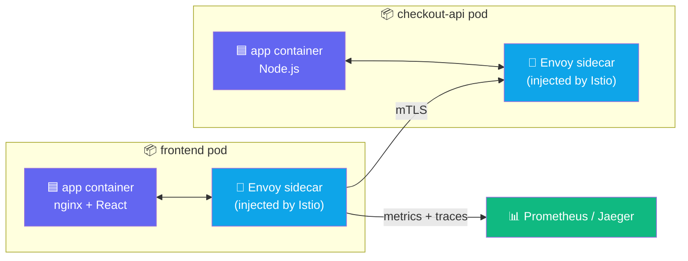
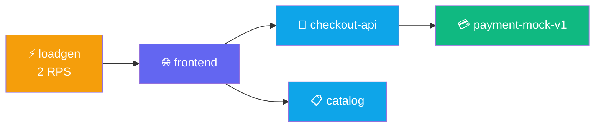

## How GitOps Works

Traditional deployments push changes directly to the cluster. GitOps flips this: Git is the
**single source of truth**, and a controller in the cluster continuously pulls from Git to
reconcile what's running with what's declared.



Every change is **auditable, reversible, and Git-authorised**. No `kubectl apply` from a laptop in
production.

---

## How Istio Sidecar Injection Works

The Rx Storefront uses **Istio** for zero-code observability. Istio injects a sidecar proxy
(Envoy) into every pod. This proxy intercepts all traffic — enabling metrics, tracing, and traffic
management without changing application code.



The namespace label `istio-injection: enabled` tells Istio to inject the sidecar automatically at
pod creation time.

---

## Exercise 1.1 — Orient: Explore the Platform

**Duration**: 30–45 min | **Goal**: Deploy a 4-service storefront via GitOps and see it live in the Kiali mesh topology.

Verify your cluster access and check that the app namespace is empty:

```terminal:execute
command: kubectl get nodes
session: 1
```

```terminal:execute
command: kubectl get all -n $SESSION_NS
session: 1
```

**👁 Observe:** No resources found — the namespace is empty and waiting for your first deployment.

Check the namespace quota:

```terminal:execute
command: kubectl describe resourcequota demo-app-quota -n $SESSION_NS
session: 1
```

Open the Demo Wall to see the platform state:

```dashboard:open-url
url: https://demo-wall-%session_name%.%ingress_domain%/
name: Demo Wall
```

### Checkpoint ✅

```examiner:execute-test
name: lab-01-nodes-ready
title: "3+ nodes in Ready state"
autostart: true
timeout: 30
command: |
  READY=$(kubectl get nodes --no-headers | grep -c " Ready")
  [ "$READY" -ge 3 ] && exit 0 || exit 1
```

---

## Exercise 1.2 — Deploy: Ship the Storefront via GitOps

Switch to the deploy overlay. ArgoCD will sync the storefront to your namespace:

```terminal:execute
command: switch-lab lab-01-deploy
session: 1
```

Watch the pods come up in terminal 2:

```terminal:execute
command: kubectl -n $SESSION_NS get pods -w
session: 2
```

Once all pods are Running, get your login credentials then open the dashboards:

```terminal:execute
command: |
  _NS=${SESSION_NS%-s*}
  echo "Username: $(kubectl get secret dkp-workshop-credentials -n $_NS -o jsonpath='{.data.username}' | base64 -d)"
  echo "Password: $(kubectl get secret dkp-workshop-credentials -n $_NS -o jsonpath='{.data.password}' | base64 -d)"
session: 1
```

```dashboard:open-url
url: https://%ingress_domain%/dkp/argocd/applications/argocd/rx-demo-%session_name%
name: ArgoCD
```

Then open the storefront:

```dashboard:open-url
url: https://frontend-%session_name%.%ingress_domain%/
name: Storefront
```

**👁 In ArgoCD observe:** Each tile = a Kubernetes resource. Green = Healthy + Synced. The
dependency tree shows Deployment → ReplicaSet → Pods exactly as Git declared it.

### Checkpoint ✅

```examiner:execute-test
name: lab-01-pods-running
title: "4 services running in your namespace"
autostart: true
timeout: 120
retries: 24
delay: 5
command: |
  RUNNING=$(kubectl -n $SESSION_NS get pods \
    --field-selector=status.phase=Running --no-headers 2>/dev/null | wc -l)
  [ "$RUNNING" -ge 4 ] && exit 0 || exit 1
```

---

## Exercise 1.3 — Verify: See the Live Mesh

Start the load generator (baseline: 2 RPS):

```terminal:execute
command: switch-lab lab-01-verify
session: 1
```

Open Kiali and navigate to **Graph → Namespace: your-namespace**:

```dashboard:open-url
url: https://%ingress_domain%/dkp/kiali/console/graph/namespaces/?namespaces=%session_namespace%
name: Kiali
```

**👁 You should see:** `frontend` → `checkout-api` → `payment-mock-v1`, and `frontend` → `catalog`.
This topology graph is generated automatically from Istio sidecar metrics — no configuration needed.



### Checkpoint ✅

```examiner:execute-test
name: lab-01-loadgen-running
title: "Load generator is running"
autostart: true
timeout: 60
command: |
  PODS=$(kubectl -n $SESSION_NS get pods -l app=demo-loadgen \
    --field-selector=status.phase=Running --no-headers 2>/dev/null | wc -l)
  [ "$PODS" -ge 1 ] && exit 0 || exit 1
```

---

## Key Takeaways

- **GitOps** means the cluster reflects Git. Changing `spec.source.path` = changing what's deployed.
- **Istio sidecar injection** happens automatically via the `istio-injection: enabled` namespace label — no app changes needed.
- **ArgoCD `prune: true`** means resources removed from Git are deleted from the cluster automatically.

Click **Next Lab** to continue to Lab 2: Observability.
