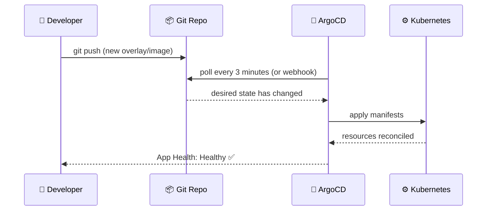
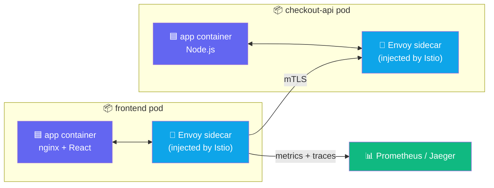
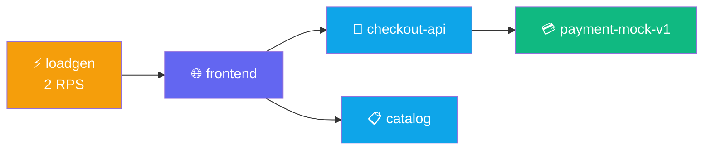

## How GitOps Works

Traditional deployments push changes directly to the cluster. GitOps flips this: Git is the
**single source of truth**, and a controller in the cluster continuously pulls from Git to
reconcile what's running with what's declared.



Every change is **auditable, reversible, and Git-authorised**. No `kubectl apply` from a laptop in
production.

---

## How Istio Sidecar Injection Works

The Rx Storefront uses **Istio** for zero-code observability. Istio injects a sidecar proxy
(Envoy) into every pod. This proxy intercepts all traffic — enabling metrics, tracing, and traffic
management without changing application code.



The namespace label `istio-injection: enabled` tells Istio to inject the sidecar automatically at
pod creation time.

---

## Exercise 1.1 — Orient: Explore the Platform

**Duration**: 30–45 min | **Goal**: Deploy a 4-service storefront via GitOps and see it live in the Kiali mesh topology.

Verify your cluster access and check that the app namespace is empty:

```bash
kubectl get nodes
```

```bash
kubectl get all -n $SESSION_NS
```

**👁 Observe:** No resources found — the namespace is empty and waiting for your first deployment.

Check the namespace quota:

```bash
kubectl describe resourcequota demo-app-quota -n $SESSION_NS
```

Open the Demo Wall to see the platform state:

Open **Demo Wall** — run in terminal to get the URL:

```bash
echo "https://demo-wall-$SESSION_NAME.$INGRESS_DOMAIN/"
```

### Checkpoint ✅


---

## Exercise 1.2 — Deploy: Ship the Storefront via GitOps

Switch to the deploy overlay. ArgoCD will sync the storefront to your namespace:

```bash
switch-lab lab-01-deploy
```

Watch the pods come up in terminal 2:

```bash
kubectl -n $SESSION_NS get pods -w
```

Once all pods are Running, get your login credentials then open the dashboards:

```bash
_NS=${SESSION_NS%-s*}
echo "Username: $(kubectl get secret dkp-workshop-credentials -n $_NS -o jsonpath='{.data.username}' | base64 -d)"
echo "Password: $(kubectl get secret dkp-workshop-credentials -n $_NS -o jsonpath='{.data.password}' | base64 -d)"
```

Open **ArgoCD** — run in terminal to get the URL:

```bash
echo "https://$INGRESS_DOMAIN/dkp/argocd/applications/argocd/rx-demo-$SESSION_NAME"
```

Then open the storefront:

Open **Storefront** — run in terminal to get the URL:

```bash
echo "https://frontend-$SESSION_NAME.$INGRESS_DOMAIN/"
```

**👁 In ArgoCD observe:** Each tile = a Kubernetes resource. Green = Healthy + Synced. The
dependency tree shows Deployment → ReplicaSet → Pods exactly as Git declared it.

### Checkpoint ✅


---

## Exercise 1.3 — Verify: See the Live Mesh

Start the load generator (baseline: 2 RPS):

```bash
switch-lab lab-01-verify
```

Open Kiali and navigate to **Graph → Namespace: your-namespace**:

Open **Kiali** — run in terminal to get the URL:

```bash
echo "https://$INGRESS_DOMAIN/dkp/kiali/console/graph/namespaces/?namespaces=$SESSION_NS"
```

**👁 You should see:** `frontend` → `checkout-api` → `payment-mock-v1`, and `frontend` → `catalog`.
This topology graph is generated automatically from Istio sidecar metrics — no configuration needed.



### Checkpoint ✅


---

## Key Takeaways

- **GitOps** means the cluster reflects Git. Changing `spec.source.path` = changing what's deployed.
- **Istio sidecar injection** happens automatically via the `istio-injection: enabled` namespace label — no app changes needed.
- **ArgoCD `prune: true`** means resources removed from Git are deleted from the cluster automatically.

Click **Next Lab** to continue to Lab 2: Observability.
