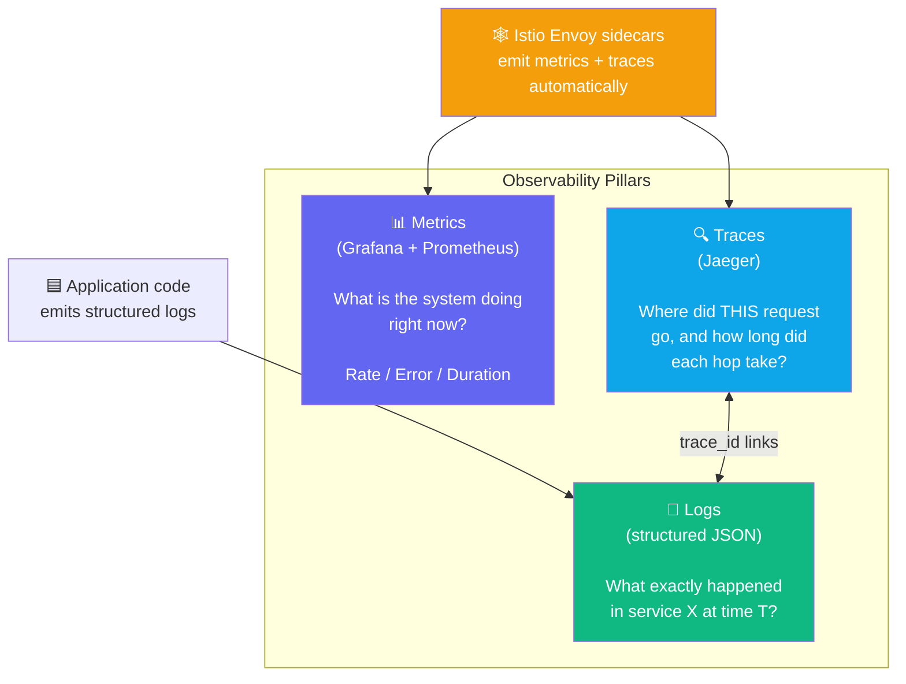
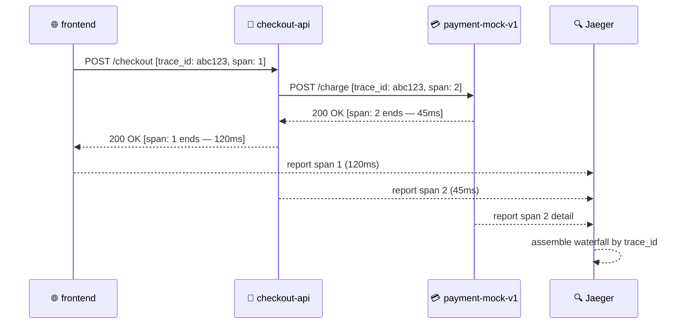
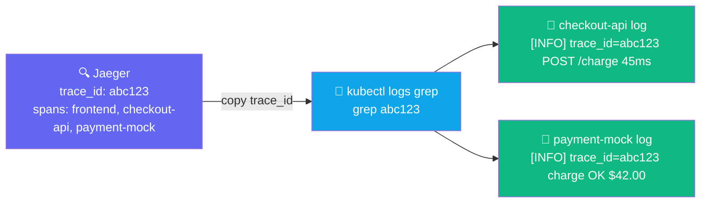

## The Three Pillars of Observability

NKP ships a complete observability stack. Each pillar answers a different question:



The key insight: **trace ID is the glue**. A single user request produces one trace spanning all
services — and every log line that contains that trace ID can be found instantly.

---

## How Distributed Tracing Works



The `trace_id` is injected into the HTTP headers by the Istio sidecar — no code changes required.

---

## Exercise 2.1 — Live Topology: Explore Kiali

**Duration**: 45–60 min | **Goal**: Explore live mesh topology, trace a request through Jaeger, and correlate logs by trace ID.

Start from the Lab 2 baseline:

```terminal:execute
command: switch-lab lab-02-start
session: 1
```

Get your login credentials, then open Kiali → Graph:

```terminal:execute
command: |
  _NS=${SESSION_NS%-s*}
  echo "Username: $(kubectl get secret dkp-workshop-credentials -n $_NS -o jsonpath='{.data.username}' | base64 -d)"
  echo "Password: $(kubectl get secret dkp-workshop-credentials -n $_NS -o jsonpath='{.data.password}' | base64 -d)"
session: 1
```

```dashboard:open-url
url: https://%ingress_domain%/dkp/kiali/console/graph/namespaces/?namespaces=%session_namespace%
name: Kiali
```

Work through the Kiali graph:
1. Set display options: **Request Rate**, **Response Time**, **Traffic Animation**
2. Click the edge between `checkout-api` → `payment-mock-v1` to see P50/P99 latency
3. Click the `frontend` node to see inbound/outbound traffic summary
4. Switch graph type: App graph → Versioned app graph → Workload graph

**👁 Observe:** Edge thickness = traffic volume. Edge colour = error rate (green=healthy, red=errors).
This is generated from Prometheus metrics Envoy emits — no instrumentation in your code.

### Checkpoint ✅

```examiner:execute-test
name: lab-02-traffic-flowing
title: "Baseline traffic is flowing (load generator running)"
autostart: true
timeout: 30
command: |
  PODS=$(kubectl -n $SESSION_NS get pods -l app=demo-loadgen \
    --field-selector=status.phase=Running --no-headers 2>/dev/null | wc -l)
  [ "$PODS" -ge 1 ] && exit 0 || exit 1
```

---

## Exercise 2.2 — Distributed Tracing: Follow a Request

Generate a checkout to produce a trace:

```terminal:execute
command: |
  STOREFRONT=$(kubectl -n $SESSION_NS get svc frontend \
    -o jsonpath='{.spec.clusterIP}')
  curl -s -X POST "http://${STOREFRONT}/api/checkout" \
    -H "Content-Type: application/json" \
    -d '{"items":[{"id":"1","qty":1}]}' | python3 -m json.tool 2>/dev/null || echo "OK"
session: 1
```

Open Jaeger and search by Service: `frontend`:

```dashboard:open-url
url: https://%ingress_domain%/dkp/jaeger/search?service=frontend&namespace=%session_namespace%
name: Jaeger
```

**Navigate the waterfall:**
1. Click on a trace to expand the **span waterfall**
2. Identify: `frontend` → `checkout-api` → `payment-mock-v1`
3. Note the duration of each span — all should be under 200ms in this healthy state
4. Click any span to see its tags: HTTP method, status code, service version

Find recent trace IDs via the terminal:

```terminal:execute
command: |
  JAEGER_URL="https://$(echo $INGRESS_DOMAIN)/dkp/jaeger"
  curl -sk "${JAEGER_URL}/api/traces?service=frontend&limit=3" | \
    python3 -c "import sys,json; [print(t['traceID']) for t in json.load(sys.stdin)['data']]" 2>/dev/null || echo "Open Jaeger UI above to see traces"
session: 1
```

### Checkpoint ✅

```examiner:execute-test
name: lab-02-checkout-works
title: "Checkout API is reachable"
autostart: false
timeout: 10
command: |
  STOREFRONT=$(kubectl -n $SESSION_NS get svc frontend \
    -o jsonpath='{.spec.clusterIP}' 2>/dev/null)
  curl -sf "http://${STOREFRONT}/" -o /dev/null && exit 0 || exit 1
```

---

## Exercise 2.3 — Log Correlation: Trace ID to Logs

A single `trace_id` links spans across services AND log lines in each service:



Copy a trace ID from Jaeger and search for it in the logs:

```terminal:execute
command: TRACE_ID="<paste-trace-id-here>"
session: 1
```

```terminal:execute
command: kubectl -n $SESSION_NS logs -l app=checkout-api --tail=100 | grep "$TRACE_ID"
session: 1
```

```terminal:execute
command: kubectl -n $SESSION_NS logs -l app=payment-mock --tail=100 | grep "$TRACE_ID"
session: 1
```

**👁 Observe:** Both services log the same `trace_id` — proving the trace spans are linked across
service boundaries. This is how on-call engineers isolate root cause without reading every log.

---

## Exercise 2.4 (Bonus) — High Load: Stress the Metrics

Switch to peak load and watch the Grafana dashboards update:

```terminal:execute
command: switch-lab lab-02-high-load
session: 1
```

Open Grafana → Istio Mesh Dashboard:

```dashboard:open-url
url: https://%ingress_domain%/dkp/logging/grafana
name: Grafana
```

Filter by namespace: `%session_namespace%`. Watch request rate spike to ~20 RPS.

**👁 Observe in Grafana:** P99 latency, error rate, and throughput update in real-time from
Prometheus. These same metrics trigger KEDA autoscaling in Lab 5.

---

## Key Takeaways

- **Kiali** gives you instant mesh topology without any instrumentation — it reads from Istio's Envoy sidecar metrics.
- **Distributed tracing** links a single user request across all services, even across pod restarts.
- **Log correlation by trace ID** lets you query logs from multiple services simultaneously for a single request.

Click **Next Lab** to continue to Lab 3: GitOps & Progressive Delivery.
