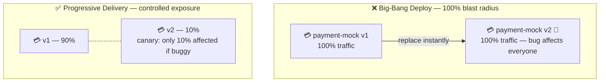
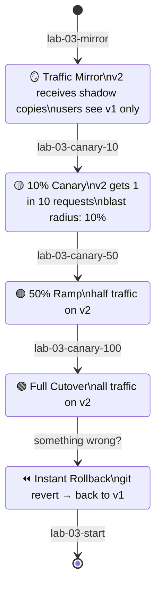
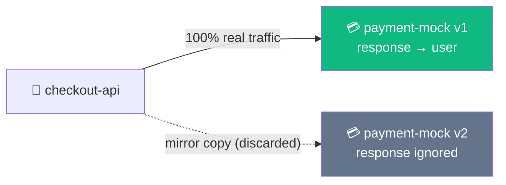
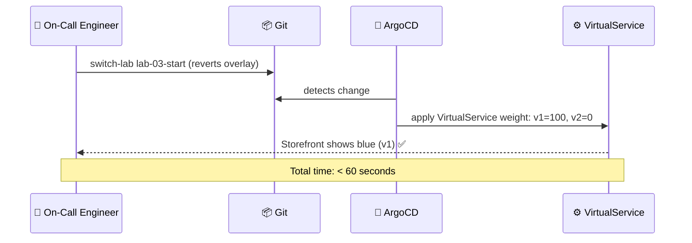

## The Risk of Big-Bang Deploys

Deploying v2 directly to 100% of users means: if v2 has a bug, 100% of users are affected
and rollback takes a full re-deploy. Progressive delivery limits the blast radius.



NKP uses **Istio VirtualService** to split traffic by weight — no DNS changes, no load balancer
config, no code changes in your app.

---

## Progressive Delivery Stages



Each `switch-lab` command applies a different Git overlay that ArgoCD syncs immediately.

---

## Exercise 3.1 — Traffic Mirroring: Test v2 with Zero Risk

**Duration**: 45–60 min | **Goal**: Canary rollout of payment-mock v2 through mirroring → 10% → 50% → 100%, then one-command rollback.

Start from Lab 3 baseline (v2 pods running, 0% traffic):

```terminal:execute
command: switch-lab lab-03-start
session: 1
```

Enable traffic mirroring:

```terminal:execute
command: switch-lab lab-03-mirror
session: 1
```

**What mirroring does:** v1 still handles 100% of real traffic. v2 receives a shadow copy of every
request — it processes them but its responses are discarded. Users see no change.



In **Kiali**, look for a **dashed line** between `checkout-api` and `payment-mock-v2` — that's
the mirror edge.

```dashboard:open-url
url: https://frontend-%session_name%.%ingress_domain%/
name: Storefront
```

The storefront always shows the **blue** (v1) theme — users see no change.

```terminal:execute
command: kubectl -n $SESSION_NS get virtualservice payment-mock-vs -o yaml | grep -A8 mirror
session: 1
```

### Checkpoint ✅

```examiner:execute-test
name: lab-03-mirror-active
title: "VirtualService has mirror stanza"
autostart: true
timeout: 30
command: |
  kubectl -n $SESSION_NS get virtualservice payment-mock-vs -o yaml 2>/dev/null | \
    grep -q "mirror:" && exit 0 || exit 1
```

---

## Exercise 3.2 — Canary 10%: Start the Rollout

```terminal:execute
command: switch-lab lab-03-canary-10
session: 1
```

Verify the weights:

```terminal:execute
command: kubectl -n $SESSION_NS get virtualservice payment-mock-vs -o yaml | grep -A5 weight
session: 1
```

Refresh the Storefront 10–20 times. About 1 in 10 loads shows the **green** (v2) theme.

Watch the traffic split in Kiali — the v2 edge is thinner but visible.

**👁 Observe in Kiali:** Two edges from `checkout-api` — a thick one to v1 (90%) and a thin one
to v2 (10%). The sidecar enforces this split at the proxy layer, not in your code.

### Checkpoint ✅

```examiner:execute-test
name: lab-03-canary-10-active
title: "VirtualService shows 90/10 split"
autostart: true
timeout: 30
command: |
  V1=$(kubectl -n $SESSION_NS get virtualservice payment-mock-vs -o jsonpath='{.spec.http[0].route[0].weight}' 2>/dev/null)
  [ "$V1" = "90" ] && exit 0 || exit 1
```

---

## Exercise 3.3 — Ramp: 50% and Full Cutover

Ramp to 50%:

```terminal:execute
command: switch-lab lab-03-canary-50
session: 1
```

Now about half the Storefront loads show green. Wait 30s and check Kiali.

Complete cutover to v2:

```terminal:execute
command: switch-lab lab-03-canary-100
session: 1
```

Every Storefront load now shows **green** (v2). All traffic is on v2.

```terminal:execute
command: kubectl -n $SESSION_NS get virtualservice payment-mock-vs -o yaml | grep -A5 weight
session: 1
```

### Checkpoint ✅

```examiner:execute-test
name: lab-03-canary-100-active
title: "VirtualService shows 0/100 (v2 full cutover)"
autostart: true
timeout: 30
command: |
  V2=$(kubectl -n $SESSION_NS get virtualservice payment-mock-vs -o jsonpath='{.spec.http[0].route[1].weight}' 2>/dev/null)
  [ "$V2" = "100" ] && exit 0 || exit 1
```

---

## Exercise 3.4 — Rollback: Back to v1 in Seconds

Imagine v2 has a bug. GitOps rollback is a single operation:

```terminal:execute
command: switch-lab lab-03-start
session: 1
```

The Storefront immediately returns to **blue** (v1). Rollback complete — under 60 seconds.



The ArgoCD audit trail shows every state transition — who changed what, when, and to what value.

---

## Key Takeaways

- **Traffic mirroring** lets you validate a new version with zero user risk.
- **Progressive delivery** limits blast radius. At 10% canary, only 10% of users are affected if v2 has a bug.
- **GitOps rollback** is a single operation — every state change is versioned, audited, and reversible.

Click **Next Lab** to continue to Lab 4: Storage & Stateful Workloads.
