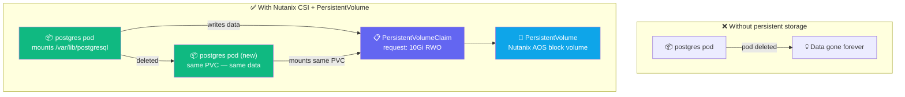
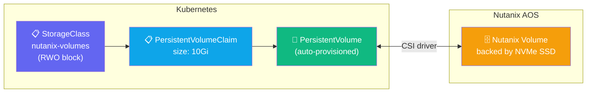
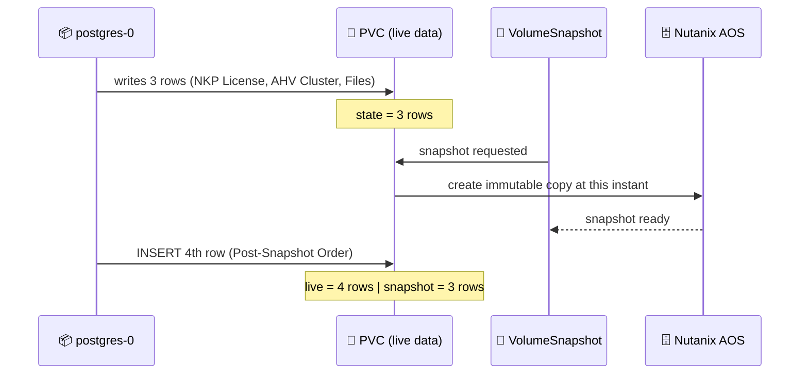

## The Problem with Stateful Apps in Kubernetes

Pods are ephemeral — when a pod is deleted, its local filesystem is gone. Databases need storage
that **outlives the pod**. Kubernetes solves this with PersistentVolumes backed by a storage provider.



---

## How Nutanix CSI Works

The CSI (Container Storage Interface) driver translates Kubernetes storage requests into Nutanix
AOS API calls — creating, attaching, and snapshotting volumes automatically.



---

## Exercise 4.1 — Explore Storage Classes

**Duration**: 45–60 min | **Goal**: Deploy PostgreSQL with Nutanix CSI, snapshot it, restore it, prove point-in-time capture.

```terminal:execute
command: kubectl get storageclass
session: 1
```

```terminal:execute
command: kubectl describe storageclass nutanix-volumes
session: 1
```

```terminal:execute
command: kubectl get volumesnapshotclass
session: 1
```

**👁 Observe:**
- `nutanix-volumes` — block storage (RWO), ideal for databases
- `nutanix-files` — file storage (RWX), ideal for shared data across pods
- `VolumeSnapshotClass` — enables point-in-time snapshots via the CSI driver

### Checkpoint ✅

```examiner:execute-test
name: lab-04-storageclasses
title: "nutanix-volumes and nutanix-files StorageClasses exist"
autostart: true
timeout: 15
command: |
  kubectl get storageclass nutanix-volumes &>/dev/null && \
  kubectl get storageclass nutanix-files &>/dev/null && exit 0 || exit 1
```

---

## Exercise 4.2 — Deploy PostgreSQL

```terminal:execute
command: switch-lab lab-04-deploy-db
session: 1
```

Watch the pod and PVC come up:

```terminal:execute
command: kubectl -n $SESSION_NS get pods,pvc -w
session: 2
```

When `postgres-0` is Running, connect and insert data:

```terminal:execute
command: |
  kubectl -n $SESSION_NS exec -it postgres-0 -- psql -U demo -d storefront -c "
    CREATE TABLE IF NOT EXISTS orders (
      id SERIAL PRIMARY KEY, product TEXT, qty INT,
      created_at TIMESTAMP DEFAULT NOW()
    );
    INSERT INTO orders (product, qty)
      VALUES ('NKP License', 10), ('AHV Cluster', 5), ('Nutanix Files', 3);
    SELECT * FROM orders;
  "
session: 1
```

**👁 Observe:** PostgreSQL is a StatefulSet — it gets a stable identity (`postgres-0`) and a
dedicated PVC that follows it. Even if the pod is rescheduled to another node, the volume
reattaches automatically.

### Checkpoint ✅

```examiner:execute-test
name: lab-04-postgres-running
title: "postgres-0 pod is Running"
autostart: true
timeout: 120
retries: 24
delay: 5
command: |
  STATUS=$(kubectl -n $SESSION_NS get pod postgres-0 \
    -o jsonpath='{.status.phase}' 2>/dev/null)
  [ "$STATUS" = "Running" ] && exit 0 || exit 1
```

---

## Exercise 4.3 — Kill the Pod: Prove Data Survives

```terminal:execute
command: kubectl -n $SESSION_NS delete pod postgres-0
session: 1
```

Watch it restart:

```terminal:execute
command: kubectl -n $SESSION_NS get pods -w -l app=postgres
session: 2
```

After it's Running again, query the data:

```terminal:execute
command: |
  kubectl -n $SESSION_NS exec -it postgres-0 -- \
    psql -U demo -d storefront -c "SELECT * FROM orders;"
session: 1
```

**👁 Observe:** All 3 rows are still there. The pod is new — the data is not. The Nutanix volume
was already attached to the replacement pod before PostgreSQL even started.

---

## Exercise 4.4 — VolumeSnapshot: Point-in-Time Backup



```terminal:execute
command: switch-lab lab-04-snapshot
session: 1
```

```terminal:execute
command: kubectl -n $SESSION_NS get volumesnapshot
session: 1
```

Now add a post-snapshot row to the live database:

```terminal:execute
command: |
  kubectl -n $SESSION_NS exec -it postgres-0 -- \
    psql -U demo -d storefront -c "
      INSERT INTO orders (product, qty) VALUES ('Post-Snapshot Order', 99);
      SELECT * FROM orders;
    "
session: 1
```

The live database now has 4 rows. The snapshot captured 3.

---

## Exercise 4.5 — Restore: Prove Point-in-Time Capture

```terminal:execute
command: switch-lab lab-04-restore
session: 1
```

Query the **restored** database:

```terminal:execute
command: |
  kubectl -n $SESSION_NS exec -it postgres-restored-0 -- \
    psql -U demo -d storefront -c "SELECT * FROM orders;"
session: 1
```

**Expected: 3 rows** — the post-snapshot insert is NOT here.

Compare with the live database:

```terminal:execute
command: |
  kubectl -n $SESSION_NS exec -it postgres-0 -- \
    psql -U demo -d storefront -c "SELECT * FROM orders;"
session: 1
```

**Expected: 4 rows** — live database has the post-snapshot insert.

**👁 The delta is the proof:** restored has exactly what existed at snapshot time. The CSI driver
created a new PVC pre-populated from the snapshot — no pg_restore, no manual data copy.

### Checkpoint ✅

```examiner:execute-test
name: lab-04-restored-running
title: "Restored postgres instance is Running"
autostart: true
timeout: 120
retries: 24
delay: 5
command: |
  STATUS=$(kubectl -n $SESSION_NS get pod postgres-restored-0 \
    -o jsonpath='{.status.phase}' 2>/dev/null)
  [ "$STATUS" = "Running" ] && exit 0 || exit 1
```

---

## Key Takeaways

- Nutanix CSI dynamically provisions block (RWO) and file (RWX) storage — no manual disk setup.
- StatefulSets guarantee stable pod identity and persistent storage across restarts.
- VolumeSnapshots give you point-in-time backups that restore to a new PVC in seconds.

Click **Next Lab** to continue to Lab 5: Production Operations.
