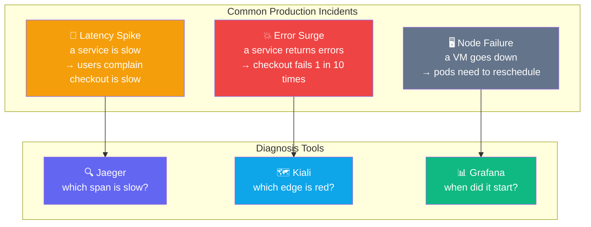
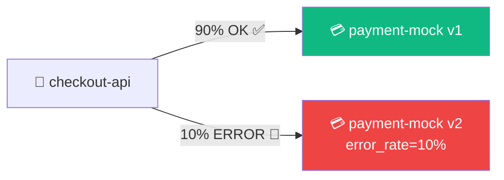
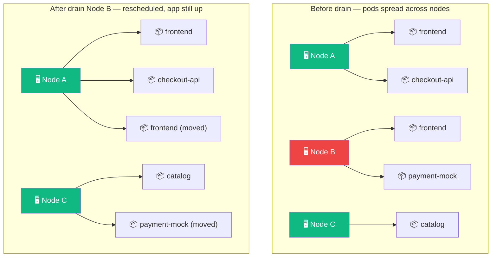
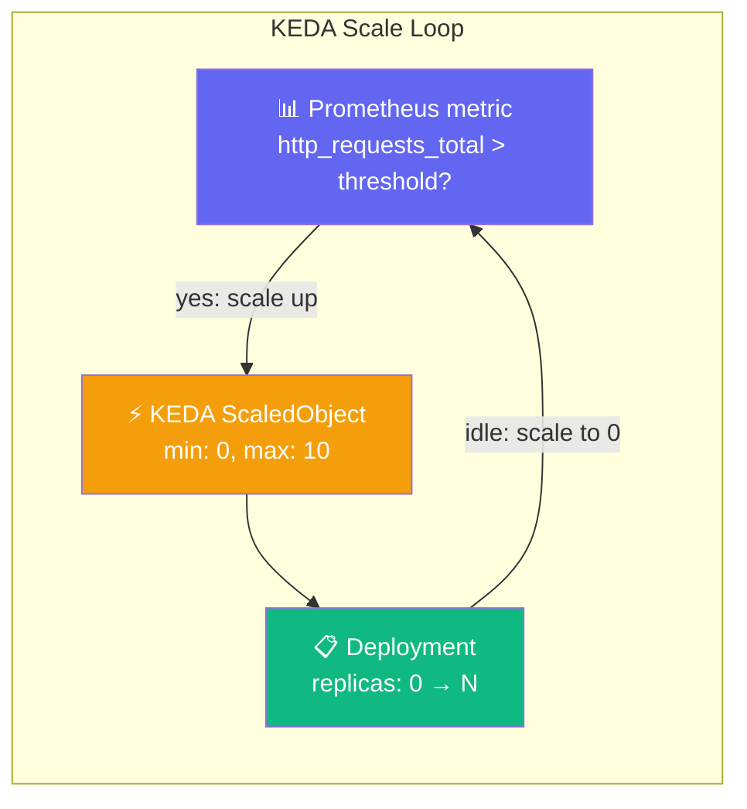

## Production Day Reality

Three types of incidents happen in production. NKP gives you tools to diagnose and recover from all three:



---

## Exercise 5.1 — Incident: Latency Injection

**Duration**: 45–60 min | **Goal**: Diagnose latency and error incidents using Jaeger, test node resilience with PDBs, configure KEDA autoscaling from zero.

Start from Lab 5 baseline:

```terminal:execute
command: switch-lab lab-05-start
session: 1
```

Inject latency into v2:

```terminal:execute
command: switch-lab lab-05-incident-latency
session: 1
```

Open the Storefront and click **Checkout** 3 times. Feel the slowness.

```dashboard:open-url
url: https://frontend-%session_name%.%ingress_domain%/
name: Storefront
```

Get your login credentials, then open Jaeger to find the slow trace:

```terminal:execute
command: |
  _NS=${SESSION_NS%-s*}
  echo "Username: $(kubectl get secret dkp-workshop-credentials -n $_NS -o jsonpath='{.data.username}' | base64 -d)"
  echo "Password: $(kubectl get secret dkp-workshop-credentials -n $_NS -o jsonpath='{.data.password}' | base64 -d)"
session: 1
```

```dashboard:open-url
url: https://%ingress_domain%/dkp/jaeger/search?service=frontend&namespace=%session_namespace%
name: Jaeger
```

**👁 Diagnosis method:** In Jaeger, sort traces by **Duration (longest first)**. Click the slowest
trace. Expand the waterfall — find the span where the duration is ~1000ms. That span names the
slow service (`payment-mock-v2`). Root cause found in under 60 seconds.

### Checkpoint ✅

```examiner:execute-test
name: lab-05-latency-injected
title: "v2 latency injection is active"
autostart: true
timeout: 30
command: |
  LATENCY=$(kubectl -n $SESSION_NS get deploy payment-mock-v2 \
    -o jsonpath='{.spec.template.spec.containers[0].env[1].value}' 2>/dev/null)
  [ "$LATENCY" = "1000" ] && exit 0 || exit 1
```

---

## Exercise 5.2 — Incident: Error Injection

```terminal:execute
command: switch-lab lab-05-incident-error
session: 1
```

**In Kiali**, watch for **red edges** on the payment-mock-v2 path:

```dashboard:open-url
url: https://%ingress_domain%/dkp/kiali/console/graph/namespaces/?namespaces=%session_namespace%
name: Kiali
```

**In Jaeger**, filter by tag `error=true` to see failed spans.

In Storefront: ~1 in 10 checkout attempts fails.



**👁 Observe in Kiali:** The edge to v2 turns red. Error percentage appears on the edge. This is
how you see a partial degradation — it's not DOWN, just failing some requests. Without the mesh
graph, you'd only know "checkout is broken sometimes."

---

## Exercise 5.3 — Node Failure Resilience

PodDisruptionBudgets (PDBs) are a contract: "Kubernetes, you may evict pods during maintenance,
but never below this minimum." This makes node drains safe.



```terminal:execute
command: switch-lab lab-05-node-resilience
session: 1
```

Verify pods are spread across nodes:

```terminal:execute
command: kubectl -n $SESSION_NS get pods -o wide
session: 1
```

Select a worker node and cordon it (prevent new scheduling):

```terminal:execute
command: |
  NODE=$(kubectl get nodes -l node-role.kubernetes.io/control-plane!= \
    -o jsonpath='{.items[0].metadata.name}')
  echo "Will drain: $NODE"
session: 1
```

```terminal:execute
command: kubectl cordon "$NODE"
session: 1
```

```terminal:execute
command: kubectl drain "$NODE" --ignore-daemonsets --delete-emptydir-data
session: 1
```

Watch pods reschedule in terminal 2:

```terminal:execute
command: kubectl -n $SESSION_NS get pods -o wide -w
session: 2
```

Verify the Storefront is still up:

```terminal:execute
command: |
  STOREFRONT=$(kubectl -n $SESSION_NS get svc frontend \
    -o jsonpath='{.spec.clusterIP}')
  curl -sf "http://${STOREFRONT}/" -o /dev/null && echo "Storefront: UP" || echo "Storefront: DOWN"
session: 1
```

Restore the node:

```terminal:execute
command: kubectl uncordon "$NODE"
session: 1
```

### Checkpoint ✅

```examiner:execute-test
name: lab-05-all-nodes-ready
title: "All nodes are Ready (after uncordon)"
autostart: false
timeout: 60
command: |
  NOT_READY=$(kubectl get nodes --no-headers | grep -v " Ready" | wc -l)
  [ "$NOT_READY" -eq 0 ] && exit 0 || exit 1
```

---

## Exercise 5.4 — KEDA Autoscaling from Zero

KEDA (Kubernetes Event-Driven Autoscaling) scales workloads based on real signals — HTTP traffic,
queue depth, CPU — and can scale all the way **to zero** when there's no traffic.



```terminal:execute
command: switch-lab lab-05-keda
session: 1
```

Watch checkout-api scale from 0:

```terminal:execute
command: kubectl -n $SESSION_NS get deploy checkout-api -w
session: 2
```

The baseline load generator triggers KEDA. Within ~30 seconds, replicas go from 0 to 1+.

```terminal:execute
command: kubectl -n $SESSION_NS describe scaledobject checkout-api-v1-keda
session: 1
```

**👁 Observe:** KEDA reads Prometheus metrics (from Istio) as the scale signal. Zero idle cost
— when there's no traffic, there are no pods. When traffic arrives, pods scale up automatically.

---

## Exercise 5.5 — Recovery

Reset all incidents:

```terminal:execute
command: switch-lab lab-05-start
session: 1
```

All fault injection cleared. 90/10 canary restored. Healthy baseline.

---

## Key Takeaways

- **Distributed tracing** identifies root cause in seconds — which service, which version, which span.
- **PodDisruptionBudgets** are a safety contract for node maintenance. `minAvailable: 1` means Kubernetes won't evict the last replica.
- **KEDA** scales on real signals. Scale-to-zero means zero idle cost; scale-up happens on real traffic demand.

Click **Next Lab** to continue to Lab 6: Multi-Tenancy & Governance.
