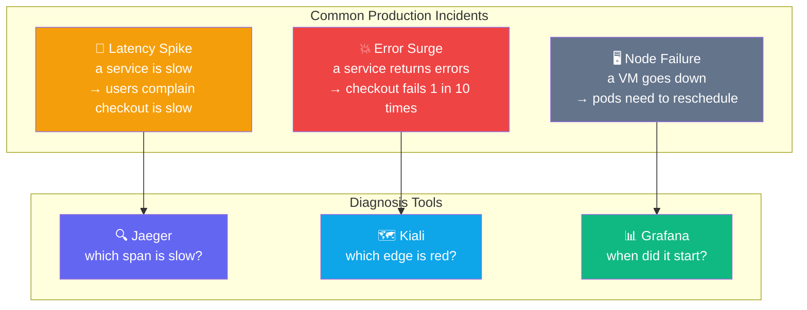
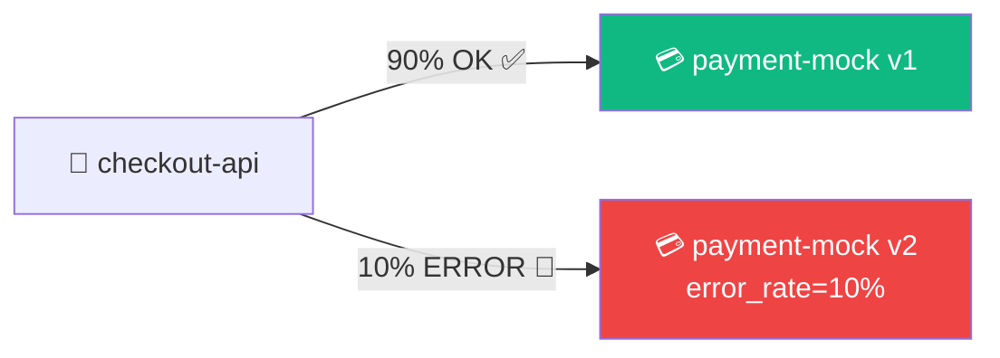
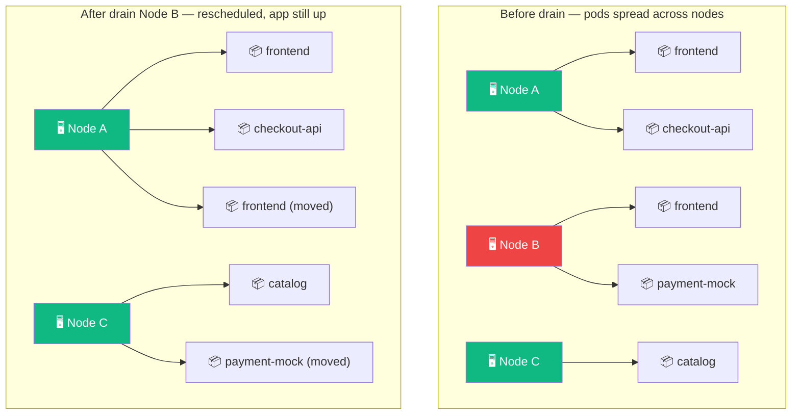
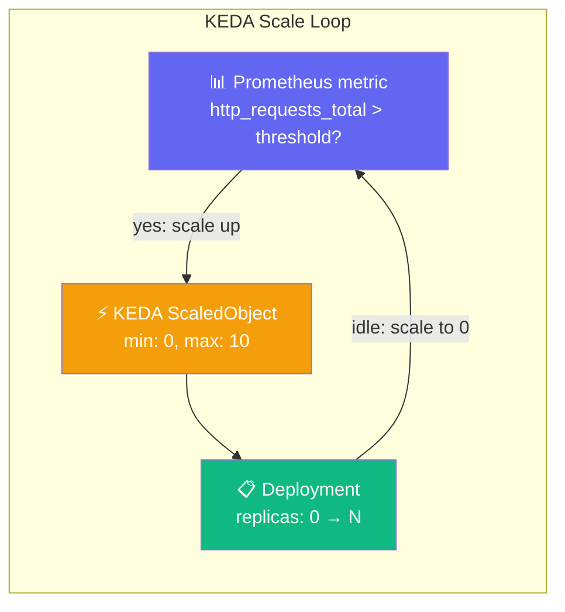

## Production Day Reality

Three types of incidents happen in production. NKP gives you tools to diagnose and recover from all three:



---

## Exercise 5.1 — Incident: Latency Injection

**Duration**: 45–60 min | **Goal**: Diagnose latency and error incidents using Jaeger, test node resilience with PDBs, configure KEDA autoscaling from zero.

Start from Lab 5 baseline:

```bash
switch-lab lab-05-start
```

Inject latency into v2:

```bash
switch-lab lab-05-incident-latency
```

Open the Storefront and click **Checkout** 3 times. Feel the slowness.

Open **Storefront** — run in terminal to get the URL:

```bash
echo "https://frontend-$SESSION_NAME.$INGRESS_DOMAIN/"
```

Get your login credentials, then open Jaeger to find the slow trace:

```bash
_NS=${SESSION_NS%-s*}
echo "Username: $(kubectl get secret dkp-workshop-credentials -n $_NS -o jsonpath='{.data.username}' | base64 -d)"
echo "Password: $(kubectl get secret dkp-workshop-credentials -n $_NS -o jsonpath='{.data.password}' | base64 -d)"
```

Open **Jaeger** — run in terminal to get the URL:

```bash
echo "https://$INGRESS_DOMAIN/dkp/jaeger/search?service=frontend&namespace=$SESSION_NS"
```

**👁 Diagnosis method:** In Jaeger, sort traces by **Duration (longest first)**. Click the slowest
trace. Expand the waterfall — find the span where the duration is ~1000ms. That span names the
slow service (`payment-mock-v2`). Root cause found in under 60 seconds.

### Checkpoint ✅


---

## Exercise 5.2 — Incident: Error Injection

```bash
switch-lab lab-05-incident-error
```

**In Kiali**, watch for **red edges** on the payment-mock-v2 path:

Open **Kiali** — run in terminal to get the URL:

```bash
echo "https://$INGRESS_DOMAIN/dkp/kiali/console/graph/namespaces/?namespaces=$SESSION_NS"
```

**In Jaeger**, filter by tag `error=true` to see failed spans.

In Storefront: ~1 in 10 checkout attempts fails.



**👁 Observe in Kiali:** The edge to v2 turns red. Error percentage appears on the edge. This is
how you see a partial degradation — it's not DOWN, just failing some requests. Without the mesh
graph, you'd only know "checkout is broken sometimes."

---

## Exercise 5.3 — Node Failure Resilience

PodDisruptionBudgets (PDBs) are a contract: "Kubernetes, you may evict pods during maintenance,
but never below this minimum." This makes node drains safe.



```bash
switch-lab lab-05-node-resilience
```

Verify pods are spread across nodes:

```bash
kubectl -n $SESSION_NS get pods -o wide
```

Select a worker node and cordon it (prevent new scheduling):

```bash
NODE=$(kubectl get nodes -l node-role.kubernetes.io/control-plane!= \
  -o jsonpath='{.items[0].metadata.name}')
echo "Will drain: $NODE"
```

```bash
kubectl cordon "$NODE"
```

```bash
kubectl drain "$NODE" --ignore-daemonsets --delete-emptydir-data
```

Watch pods reschedule in terminal 2:

```bash
kubectl -n $SESSION_NS get pods -o wide -w
```

Verify the Storefront is still up:

```bash
STOREFRONT=$(kubectl -n $SESSION_NS get svc frontend \
  -o jsonpath='{.spec.clusterIP}')
curl -sf "http://${STOREFRONT}/" -o /dev/null && echo "Storefront: UP" || echo "Storefront: DOWN"
```

Restore the node:

```bash
kubectl uncordon "$NODE"
```

### Checkpoint ✅


---

## Exercise 5.4 — KEDA Autoscaling from Zero

KEDA (Kubernetes Event-Driven Autoscaling) scales workloads based on real signals — HTTP traffic,
queue depth, CPU — and can scale all the way **to zero** when there's no traffic.



```bash
switch-lab lab-05-keda
```

Watch checkout-api scale from 0:

```bash
kubectl -n $SESSION_NS get deploy checkout-api -w
```

The baseline load generator triggers KEDA. Within ~30 seconds, replicas go from 0 to 1+.

```bash
kubectl -n $SESSION_NS describe scaledobject checkout-api-v1-keda
```

**👁 Observe:** KEDA reads Prometheus metrics (from Istio) as the scale signal. Zero idle cost
— when there's no traffic, there are no pods. When traffic arrives, pods scale up automatically.

---

## Exercise 5.5 — Recovery

Reset all incidents:

```bash
switch-lab lab-05-start
```

All fault injection cleared. 90/10 canary restored. Healthy baseline.

---

## Key Takeaways

- **Distributed tracing** identifies root cause in seconds — which service, which version, which span.
- **PodDisruptionBudgets** are a safety contract for node maintenance. `minAvailable: 1` means Kubernetes won't evict the last replica.
- **KEDA** scales on real signals. Scale-to-zero means zero idle cost; scale-up happens on real traffic demand.

Click **Next Lab** to continue to Lab 6: Multi-Tenancy & Governance.
