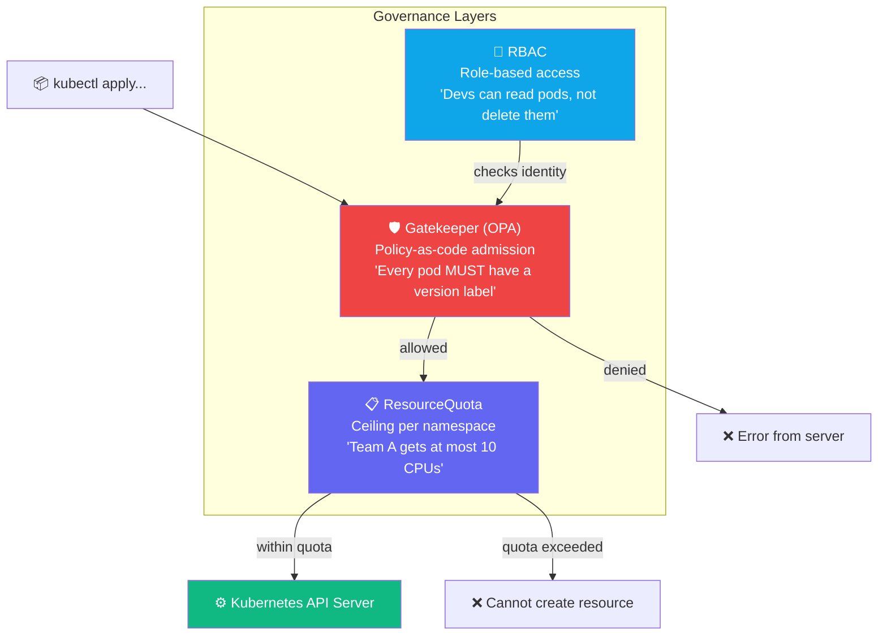
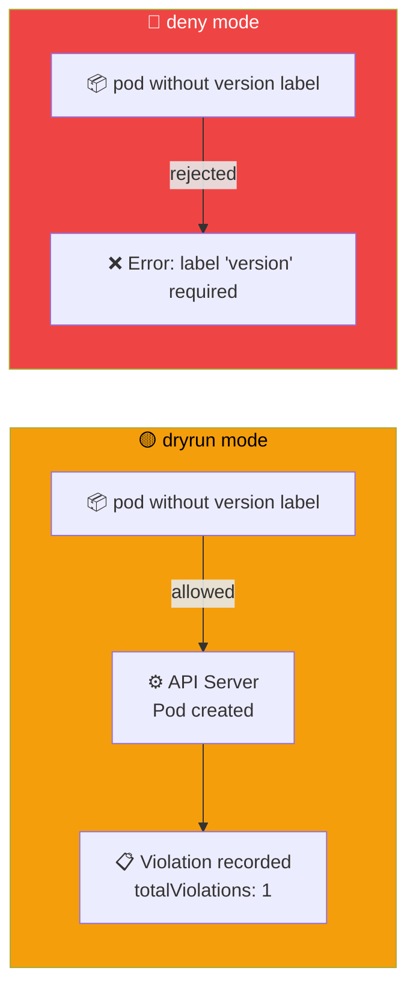
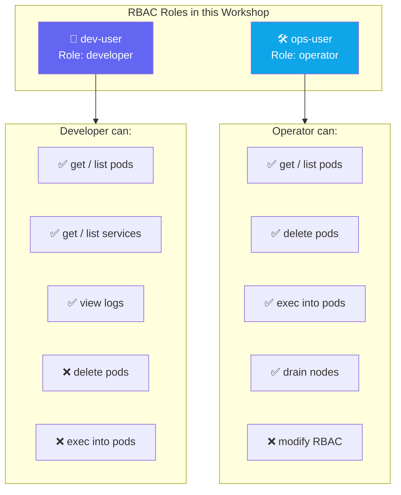

## Why Governance Matters

A shared cluster without governance leads to:
- One team using all the CPU — other teams starve
- An app without required labels — monitoring breaks
- A developer accidentally deleting production resources

NKP enforces governance at three levels:



These layers are cumulative — a request must pass all three.

---

## Exercise 6.1 — Quota Enforcement

**Duration**: 30–45 min | **Goal**: Enforce namespace quotas, use Gatekeeper in audit then deny mode, verify RBAC role separation.

Start Lab 6 baseline:

```terminal:execute
command: switch-lab lab-06-start
session: 1
```

Apply quota pressure (20 stress pods):

```terminal:execute
command: switch-lab lab-06-quota-pressure
session: 1
```

Check current quota usage:

```terminal:execute
command: kubectl describe resourcequota demo-app-quota -n $SESSION_NS
session: 1
```

Try to scale beyond the quota:

```terminal:execute
command: kubectl -n $SESSION_NS scale deploy quota-stress --replicas=30
session: 1
```

Check events for quota rejection:

```terminal:execute
command: kubectl -n $SESSION_NS get events --sort-by=.lastTimestamp | tail -5
session: 1
```

**👁 Observe:** The scale command succeeds (Deployment updated) but the pods fail to be created.
The events show: `exceeded quota`. The quota enforces a ceiling, not a hard limit on API calls —
the Deployment records the desired state, but the API server refuses to schedule the pods.

### Checkpoint ✅

```examiner:execute-test
name: lab-06-quota-stress-running
title: "Quota stress deployment is active"
autostart: true
timeout: 60
command: |
  kubectl -n $SESSION_NS get deploy quota-stress &>/dev/null && exit 0 || exit 1
```

---

## Exercise 6.2 — Gatekeeper Audit Mode

Gatekeeper enforces policies at admission time using OPA (Open Policy Agent). Before enforcing,
use `dryrun` mode to **audit** violations without breaking anything.



Check current enforcement mode (should be dryrun):

```terminal:execute
command: |
  kubectl get k8sdemorequiredlabels demo-required-labels \
    -o jsonpath='{.spec.enforcementAction}'
  echo ""
session: 1
```

Apply the policy-violating pod (missing `version` label):

```terminal:execute
command: kubectl apply -f ~/exercises/policy-violation-example.yaml
session: 1
```

**Expected: Pod created** — dryrun mode allows it but records a violation.

Check violation count:

```terminal:execute
command: |
  kubectl get k8sdemorequiredlabels demo-required-labels \
    -o jsonpath='{.status.totalViolations}'
  echo " violation(s)"
session: 1
```

Clean up:

```terminal:execute
command: kubectl -n $SESSION_NS delete pod policy-violation-example --ignore-not-found
session: 1
```

---

## Exercise 6.3 — Gatekeeper Enforce Mode

Once you've audited violations and know what's non-compliant, switch to `deny` to block bad
workloads at the door:

```terminal:execute
command: switch-lab lab-06-policy-enforce
session: 1
```

Verify mode has switched to deny:

```terminal:execute
command: |
  kubectl get k8sdemorequiredlabels demo-required-labels \
    -o jsonpath='{.spec.enforcementAction}'
  echo ""
session: 1
```

Try the same violation pod — it will now be **rejected at admission**:

```terminal:execute
command: kubectl apply -f ~/exercises/policy-violation-example.yaml
session: 1
```

**Expected:** `Error from server — [demo-required-labels] label 'version' is required`.

Confirm the pod was not created:

```terminal:execute
command: kubectl -n $SESSION_NS get pod policy-violation-example
session: 1
```

**Expected:** `Error from server (NotFound)`.

### Checkpoint ✅

```examiner:execute-test
name: lab-06-enforce-active
title: "Gatekeeper constraint is in deny mode"
autostart: true
timeout: 30
command: |
  MODE=$(kubectl get k8sdemorequiredlabels demo-required-labels \
    -o jsonpath='{.spec.enforcementAction}' 2>/dev/null)
  [ "$MODE" = "deny" ] && exit 0 || exit 1
```

---

## Exercise 6.4 — RBAC Role Separation

RBAC maps **who** (ServiceAccount) → **what** (verbs) → **where** (namespace/resource):



Check what the dev-user can and cannot do:

```terminal:execute
command: |
  echo "=== Dev User Permissions ==="
  echo -n "get pods: "
  kubectl auth can-i get pods -n $SESSION_NS \
    --as=system:serviceaccount:$SESSION_NS:dev-user
  echo -n "delete pods: "
  kubectl auth can-i delete pods -n $SESSION_NS \
    --as=system:serviceaccount:$SESSION_NS:dev-user
session: 1
```

```terminal:execute
command: |
  echo "=== Ops User Permissions ==="
  echo -n "delete pods: "
  kubectl auth can-i delete pods -n $SESSION_NS \
    --as=system:serviceaccount:$SESSION_NS:ops-user
  echo -n "exec into pods: "
  kubectl auth can-i create pods/exec -n $SESSION_NS \
    --as=system:serviceaccount:$SESSION_NS:ops-user
session: 1
```

**👁 Observe:** `yes`/`no` is enforced by the API server, not by trust. A dev-user token physically
cannot delete pods — the API server rejects the request. No sudo, no escaping, no bypassing.

---

## Key Takeaways

- **ResourceQuotas** give teams self-service within a ceiling. Platform engineers set the policy; developers work freely within it.
- **Gatekeeper** policy-as-code: start with `dryrun` to audit without breaking things, switch to `deny` once ready to enforce.
- **RBAC** at the namespace level separates developer read-only from ops full-control — enforced by the API server, not trust.

Click **Finish** to continue to the Workshop Summary.
