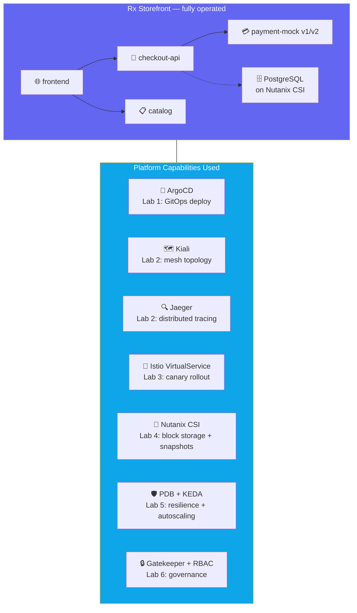
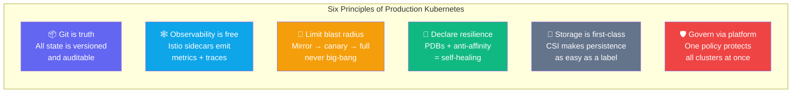

## What You Built

You took a 4-service microservices application from zero to production-operated, with full
GitOps, observability, resilience, and governance — all on Nutanix Kubernetes Platform.

---

## What You Accomplished

| Lab | What You Did |
|-----|-------------|
| **Lab 1** | Deployed a 4-service storefront via GitOps (ArgoCD + Kustomize) |
| **Lab 2** | Explored live mesh topology, traced requests through Jaeger, correlated logs by trace ID |
| **Lab 3** | Performed a canary rollout with traffic mirroring, 10/50/100% splits, and instant rollback |
| **Lab 4** | Ran PostgreSQL with Nutanix CSI block storage, took a VolumeSnapshot, restored it |
| **Lab 5** | Diagnosed latency/error incidents, drained a node with PDBs, autoscaled with KEDA |
| **Lab 6** | Enforced namespace quotas, used Gatekeeper in audit then deny mode, verified RBAC |

---

## The Core Principles — Commit These to Memory

---

## NKP Platform Capabilities You Used

| Capability | Purpose |
|-----------|---------|
| **ArgoCD** | GitOps continuous delivery, prune on sync, self-heal |
| **Istio** | Service mesh, traffic splitting, mirroring, mTLS |
| **Kiali** | Live mesh topology visualization |
| **Jaeger** | Distributed tracing with OpenTelemetry |
| **Grafana** | Time-series metrics and dashboards |
| **Gatekeeper** | OPA-based admission control (audit → enforce) |
| **KEDA** | Event-driven autoscaling from zero |
| **Nutanix CSI** | Block (RWO) and file (RWX) dynamic provisioning |
| **VolumeSnapshots** | Point-in-time CSI snapshots and restore |

---

## Next Steps

- Explore the full NKP documentation at the NKP Console
- Try adding a second cluster to the Kommander workspace
- Experiment with building your own ArgoCD Application pointing at a custom repo
- Review the Instructor Guide for advanced demo scenarios

Thank you for participating in the NKP Hands-On Workshop!
