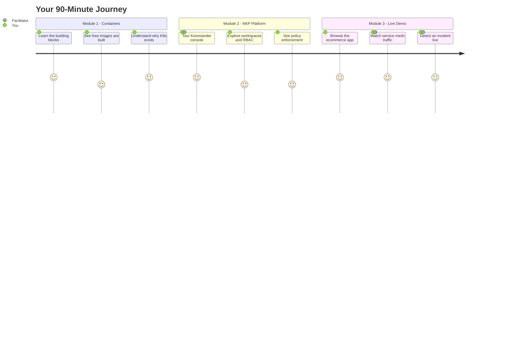

## Welcome to the NKP Partner Workshop

You are about to experience **Nutanix Kubernetes Platform** end-to-end in 90 minutes.
Three connected modules take you from "what is a container?" to watching a live incident
get detected in seconds on a production-grade platform.

---

## Agenda

| # | Module | What You Will Do | Duration |
|---|--------|-----------------|----------|
| 1 | **Container Fundamentals** | Hands-on terminal exercises: inspect images, run containers, understand Kubernetes pods | ~25 min |
| 2 | **NKP Kommander Tour** | Navigate the console, explore workspaces, RBAC policies, and the app catalog | ~35 min |
| 3 | **Ecommerce Live Demo** | Browse a live app, watch Kiali service graphs, trace an incident with Jaeger | ~30 min |

---

## Why This Matters for Partners

Your customers are already running VMs on Nutanix. NKP adds Kubernetes **on top of the same infrastructure** -- no rip and replace. This workshop shows you what that looks like in practice so you can demo it with confidence.

> **By the end**, you will have run `kubectl` commands on a live cluster, seen how Kommander manages multi-cluster RBAC, and watched a service mesh detect a latency incident in real time.

Click **Next** to begin with containers.
