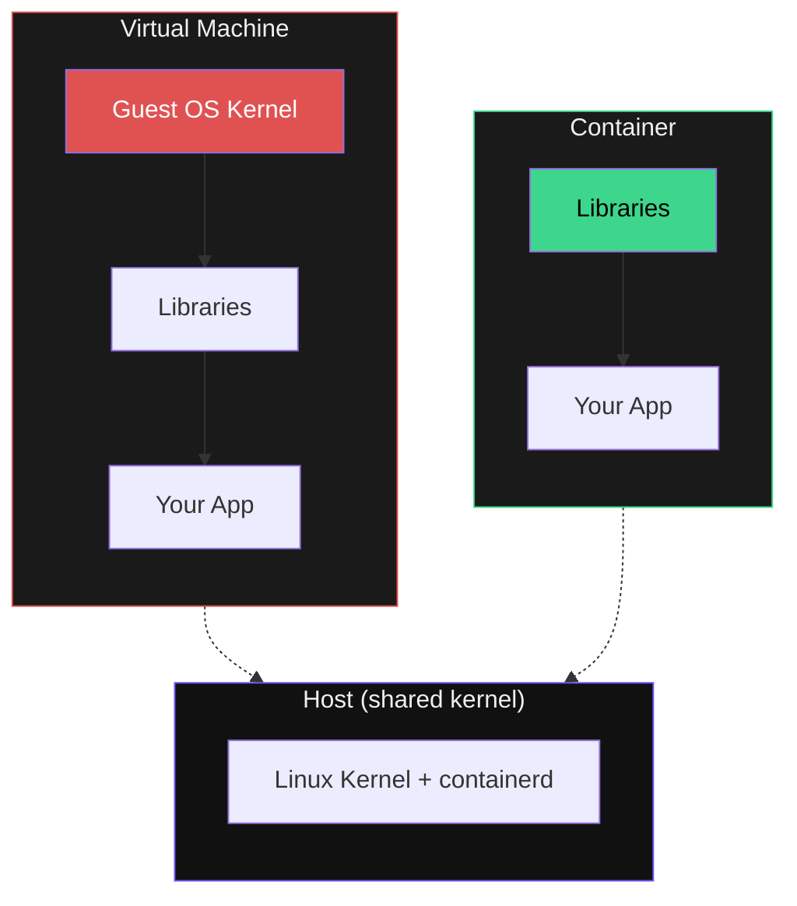
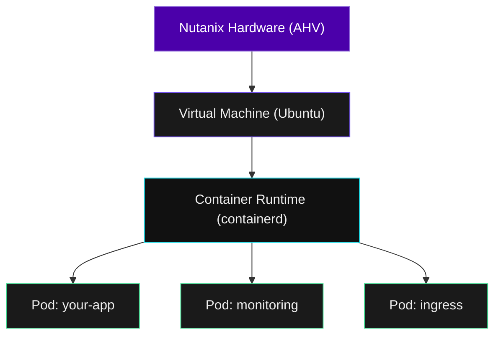

## See It First

Let's start by running a container right now:

```terminal:execute
command: kubectl run hello --image=busybox:glibc --restart=Never -- echo "Hello from a container!"
```

```terminal:execute
command: kubectl logs hello
```

You just ran a process inside an isolated environment. No VM boot. No OS install. It took **under 2 seconds**.

Clean up:

```terminal:execute
command: kubectl delete pod hello --wait=false
```

---

## Containers vs VMs



> **A VM is a house** (full foundation, plumbing, wiring).
> **A container is a shipping container** (just the cargo). Stack hundreds on one ship.

| | Virtual Machine | Container |
|-|----------------|-----------|
| Includes | Full guest OS kernel + app | App + libraries only |
| Startup | 30-60 seconds | Under 1 second |
| Size | Gigabytes | Megabytes |
| Density | ~10 per host | ~100s per host |
| Isolation | Hypervisor | Linux namespaces + cgroups |

---

## Prove It -- Check What is Running

```terminal:execute
command: kubectl get pods -n kube-system --no-headers | head -10
```

**What happened?** Every component of Kubernetes itself runs as a container. The control plane (API server, scheduler, controller-manager) and networking (Cilium) are all containers. Containers running containers.

---

## The Stack on Nutanix



NKP runs **on** your existing Nutanix infrastructure. VMs host the Kubernetes nodes, containers run inside. No rip and replace -- additive.
