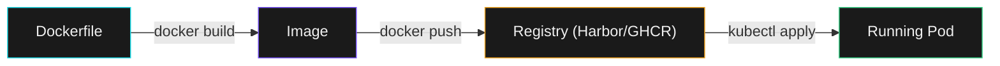
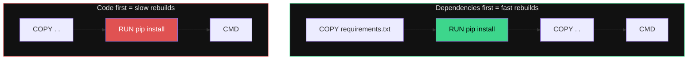

## Inspect a Real Image

Before we talk about Dockerfiles, let's look at what is already running:

```terminal:execute
command: kubectl get pods -n educates -o jsonpath='{range .items[*]}{.spec.containers[*].image}{"\n"}{end}' | sort -u
```

**What happened?** Every pod has an `image` field -- the container image it was built from. These images were built from Dockerfiles and stored in a registry.

---

## The Recipe -- A Dockerfile



A Dockerfile is a plain text recipe. Each instruction creates a **layer**:

```dockerfile
FROM python:3.11-slim          # Start from a base image
WORKDIR /app                   # Set working directory
COPY requirements.txt .        # Copy dependency list
RUN pip install -r requirements.txt  # Install dependencies (cached layer)
COPY . .                       # Copy application code
EXPOSE 8080                    # Document the port
CMD ["python", "app.py"]       # Default startup command
```

---

## Layer Caching -- Why Order Matters



Copy dependencies **before** code. When only code changes, the `pip install` layer is cached and the rebuild takes seconds instead of minutes.

---

## See Image Layers Live

```terminal:execute
command: kubectl get pod -n educates -l deployment=secrets-manager -o jsonpath='{.items[0].status.containerStatuses[0].imageID}' | cut -d@ -f1
```

**What happened?** Every running container has an `imageID` -- a content-addressable hash. Two pods from the same image share layers on disk. This is why you can run 100 containers of the same image with minimal extra storage.

> **Key takeaway**: Images are immutable. Once built, they never change. You deploy new versions by building a new image, not by modifying a running container.
