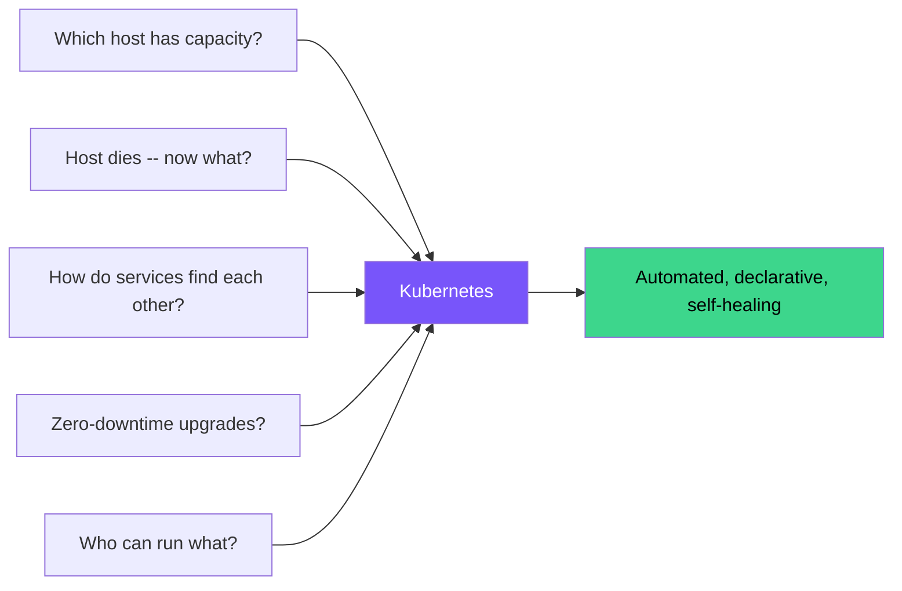
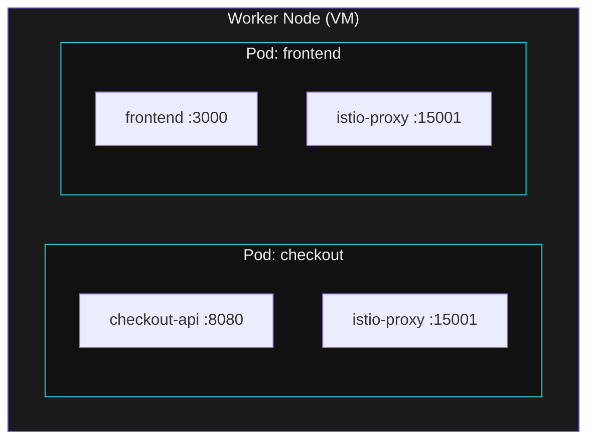

## The Problem at Scale

You can run one container with `docker run`. But what happens with 200 containers across 20 hosts?



---

## See Kubernetes in Action

```terminal:execute
command: kubectl get nodes -o wide
```

**What happened?** These are the worker VMs in your cluster. Kubernetes is managing all of them as a single pool of compute.

```terminal:execute
command: kubectl get pods -A --no-headers | wc -l
```

**What happened?** That is the total number of containers running across all nodes right now. Kubernetes is scheduling, monitoring, and restarting every one of them automatically.

---

## The Pod -- Kubernetes Building Block



A **Pod** wraps one or more containers that share networking. The app container and its sidecar (like Istio proxy) run together and communicate over `localhost`.

---

## Self-Healing -- Kill a Pod, Watch It Come Back

```terminal:execute
command: kubectl get pods -n kube-system -l k8s-app=kube-dns
```

Note the pod names. Now let's delete one:

```terminal:execute
command: kubectl delete pod -n kube-system -l k8s-app=kube-dns --wait=false | head -1
```

```terminal:execute
command: sleep 3 && kubectl get pods -n kube-system -l k8s-app=kube-dns
```

**What happened?** Kubernetes immediately created a replacement. The desired state says "2 DNS pods must run." You deleted one, Kubernetes restored it. This is **declarative self-healing** -- you describe the end state, Kubernetes enforces it continuously.

---

## What Kubernetes Gives You

| Capability | What It Means |
|-----------|---------------|
| **Scheduling** | Finds the right node based on CPU/memory requests |
| **Self-healing** | Restarts crashed containers, replaces failed nodes |
| **Service discovery** | Every service gets a DNS name automatically |
| **Rolling updates** | New versions deploy gradually with auto-rollback |
| **Storage** | Persistent volumes via Nutanix CSI |
| **Secrets** | Inject credentials without baking them into images |

> **But Kubernetes alone is not enough for enterprise.** That is where NKP comes in -- next page.
