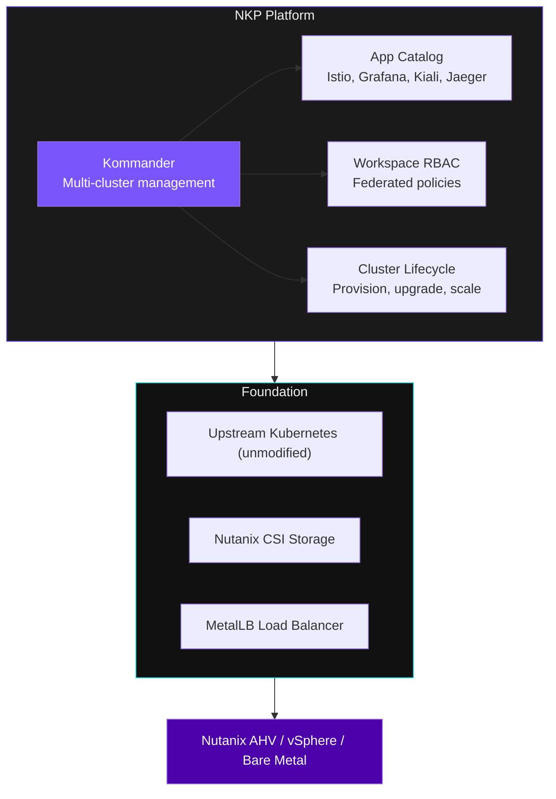

## Kubernetes Is Not Enough

Every team that "just runs Kubernetes" ends up building their own answers to these questions:

- Which distribution? Maintained by whom?
- How do we install observability?
- How do 20 clusters get managed without logging into each one?
- How do developers get scoped kubeconfigs?
- How do we enforce resource limits everywhere?

**NKP answers all of these out of the box.**

---

## The NKP Platform Stack



NKP is **100% upstream Kubernetes** -- same binaries the community ships -- with an enterprise management layer on top.

---

## See It Live -- What is Running on This Cluster

```terminal:execute
command: kubectl get namespaces | grep -E 'kommander|cert-manager|kube-system|metallb'
```

**What happened?** These namespaces are the NKP platform components. Kommander manages the fleet, cert-manager handles TLS, MetalLB provides load balancer IPs.

```terminal:execute
command: kubectl get pods -n kommander-default-workspace --no-headers | wc -l
```

**What happened?** That is the number of platform services running in the default workspace. Grafana, Prometheus, Traefik, and more -- all deployed automatically by NKP.

---

## NKP vs Vanilla Kubernetes

| | Vanilla Kubernetes | NKP |
|-|-------------------|-----|
| Multi-cluster management | Build your own | **Kommander** -- included |
| Observability | Install manually | **App Catalog** -- one click |
| RBAC across clusters | Per-cluster config | **Workspace policies** -- federated |
| Policy enforcement | Bring your own | **Kyverno** -- included |
| Storage integration | DIY CSI setup | **Nutanix CSI** -- pre-configured |
| Cluster lifecycle | Manual upgrades | **Managed** -- provision, upgrade, scale |

---

## The Partner Pitch

> **"Your customers are already running VMs on Nutanix. NKP adds Kubernetes on top of the same infrastructure -- no rip and replace. Their developers get the platform they are asking for, and your team gets a supported, enterprise-grade product to sell and service."**

Next: Let's tour the Kommander console and see how workspaces work.
