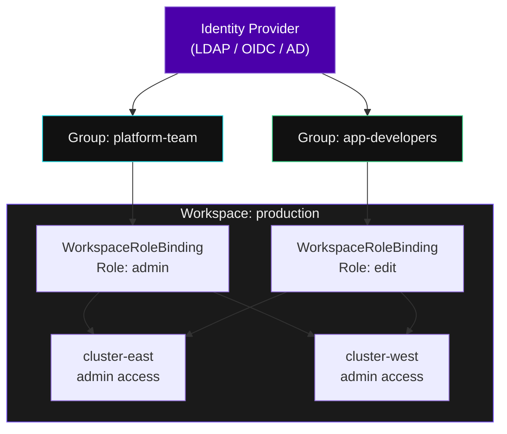
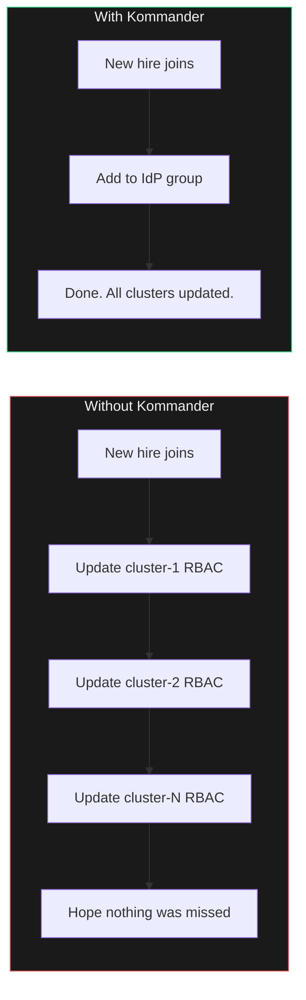

## The Problem

A large enterprise runs dozens of teams needing different access to different clusters. Without a management layer, an operator must configure RBAC on every cluster individually. Add a team member -- update N clusters. Add a cluster -- re-apply all policies. **This does not scale.**

---

## How Kommander Solves It



**One binding, every cluster.** Assign a group to a workspace with a role, and every member gets the right permissions on every cluster in that workspace -- automatically. Add a new cluster to the workspace and it inherits all policies instantly.

---

## Exercise -- Explore Workspaces

```terminal:execute
command: kubectl get workspaces -A 2>/dev/null || echo "Workspaces are managed via the Kommander API -- let's check what exists:"
```

```terminal:execute
command: kubectl get namespaces | grep -E 'kommander|workspace'
```

**What happened?** Each workspace maps to a namespace in Kommander. The `kommander-default-workspace` is the built-in workspace where platform services run.

---

## Exercise -- See Role Bindings

```terminal:execute
command: kubectl get clusterrolebindings --no-headers | grep kommander | head -10
```

**What happened?** These are the RBAC bindings that Kommander created automatically. Each one maps a workspace role to a Kubernetes ClusterRoleBinding. When a new cluster joins the workspace, these bindings are replicated automatically.

---

## Why This Matters for Your Customers



One source of truth. Zero per-cluster configuration. The platform scales with the fleet.
