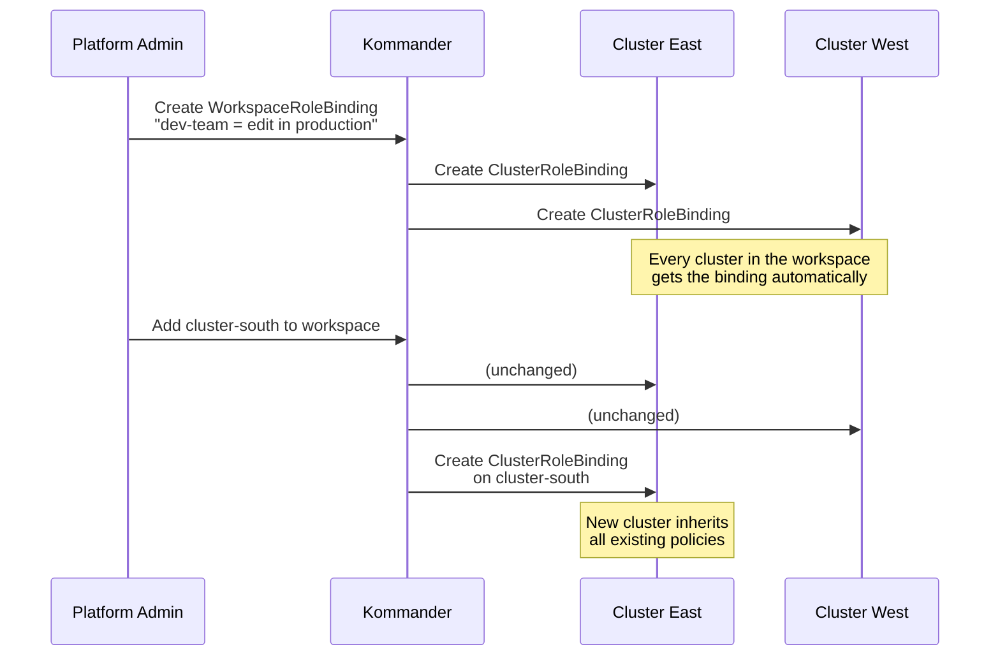

## NKP Ships with Ready-Made Roles

```terminal:execute
command: kubectl get clusterroles --no-headers | grep -E 'kommander-workspace' | head -5
```

**What happened?** NKP pre-creates workspace roles. These map to Kubernetes RBAC and propagate to every cluster in the workspace.

| Role | What It Allows |
|------|---------------|
| `admin` | Full management of all resources in the workspace |
| `edit` | Create and modify workloads, services, configmaps |
| `view` | Read-only -- list and describe, no mutations |

---

## How a Policy Flows



---

## Exercise -- Inspect Live Policies

```terminal:execute
command: kubectl get clusterrolebindings -o custom-columns='NAME:.metadata.name,ROLE:.roleRef.name' | grep -E 'admin|edit|view' | head -10
```

**What happened?** These are real, active RBAC bindings on this cluster. In production, these would be federated from Kommander across the entire fleet.

---

## Exercise -- Test Your Own Permissions

```terminal:execute
command: kubectl auth can-i create deployments -n default
```

```terminal:execute
command: kubectl auth can-i delete nodes
```

**What happened?** Your session has `cluster-admin` -- you can do everything. In a real deployment, different teams would have different scoped roles via workspace policies.

---

## The Security Story for Customers

> **Auditors love this.** One policy definition, one audit trail, consistent enforcement across every cluster. No "we forgot to update cluster-7" scenarios. Kommander is the control plane for access -- Kubernetes does the enforcement.
