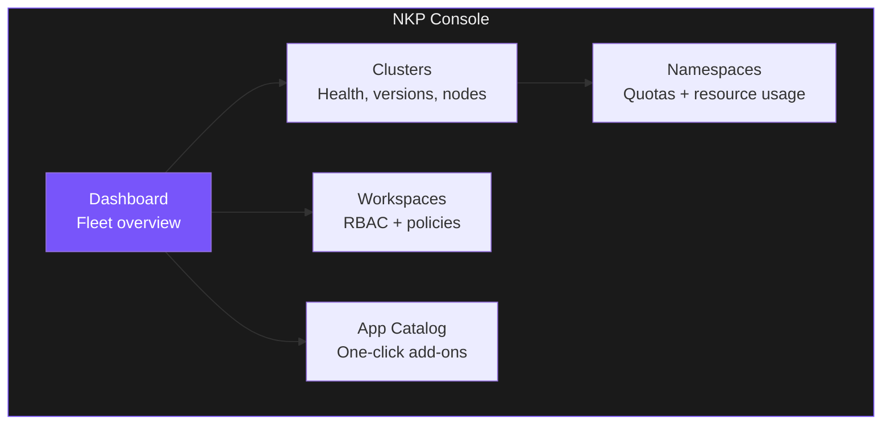

> **This section is facilitator-led.** Your facilitator will share their screen and navigate the NKP console live. Follow along in your terminal.

---

## What the Console Shows



---

## Stop 1 -- Cluster Fleet

**Facilitator shows**: Dashboard > Clusters

While your facilitator navigates, check what you can see from the terminal:

```terminal:execute
command: kubectl get nodes -o custom-columns='NODE:.metadata.name,STATUS:.status.conditions[-1:].type,CPU:.status.capacity.cpu,MEMORY:.status.capacity.memory'
```

**What happened?** These are the same nodes visible in the console. The console adds real-time graphs, health indicators, and one-click management actions.

---

## Stop 2 -- Resource Quotas

**Facilitator shows**: Clusters > Namespaces

```terminal:execute
command: kubectl get resourcequotas -A --no-headers 2>/dev/null | head -5 || echo "No resource quotas configured on this cluster yet"
```

**What happened?** In production, every team namespace has a hard quota. A rogue deployment cannot starve the rest of the cluster. These quotas are defined in Git and deployed by GitOps.

---

## Stop 3 -- App Catalog

**Facilitator shows**: App Catalog

```terminal:execute
command: kubectl get helmreleases -A --no-headers 2>/dev/null | head -10 || kubectl get helmcharts -A --no-headers 2>/dev/null | head -10 || echo "Helm releases managed via Kommander catalog"
```

**What happened?** The App Catalog is a curated set of platform add-ons: Istio, Grafana, Prometheus, Jaeger, Kiali, and more. One click to enable, one click to configure. No Helm chart hunting.

---

## Stop 4 -- Observability Stack

```terminal:execute
command: kubectl get pods -n kommander-default-workspace --no-headers | grep -E 'grafana|prometheus|traefik' | head -5
```

**What happened?** Grafana, Prometheus, and Traefik are running right now as part of the default NKP deployment. Your customers get a full observability stack from day one -- no manual installation.

> **Key takeaway**: The console is the single pane of glass. But everything it shows is also accessible via `kubectl` and APIs. The console is a convenience layer, not a lock-in.
