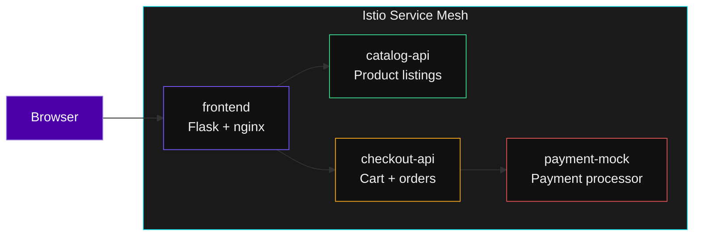

## What You Are Deploying

A real microservices ecommerce application -- the same kind of workload your customers run on NKP.



Every pod gets an **Istio sidecar** automatically -- a proxy that intercepts all traffic. Zero code changes. The mesh provides mTLS encryption, traffic routing, and full observability.

---

## Exercise -- Deploy the App

Your namespace already has Istio sidecar injection enabled. Deploy the 4-service app:

```terminal:execute
command: kubectl apply -f exercises/demo-app.yaml -n $(session_namespace)
```

```terminal:execute
command: kubectl get pods -n $(session_namespace) -w
```

**What happened?** Each pod has **two containers** -- the app and `istio-proxy`. The proxy intercepts all inbound and outbound traffic. That is how the mesh gets its data without any application code changes. Press `Ctrl+C` when all pods show `2/2 Running`.

---

## The Four Services

| Service | Role | Why It Matters |
|---------|------|---------------|
| **frontend** | Browser-facing UI | Calls other services -- shows service-to-service communication |
| **catalog-api** | Product listings | Stateless microservice -- scales horizontally |
| **checkout-api** | Cart and orders | Calls payment-mock -- creates a dependency chain |
| **payment-mock** | Simulated payments | Will be the target of our incident scenario |

---

## Exercise -- Check the Sidecars

```terminal:execute
command: kubectl get pods -n $(session_namespace) -o jsonpath='{range .items[*]}{.metadata.name}{"\t"}{range .spec.containers[*]}{.name}{" "}{end}{"\n"}{end}'
```

**What happened?** Every pod has two containers: `app` and `istio-proxy`. The proxy was injected automatically because your namespace has the `istio-injection: enabled` label. No Dockerfile changes. No application changes.

---

## Start Traffic

Deploy a traffic generator so the mesh has data to show:

```terminal:execute
command: kubectl apply -f exercises/traffic-generator.yaml -n $(session_namespace)
```

```terminal:execute
command: sleep 5 && kubectl logs -n $(session_namespace) -l app=traffic-generator --tail=5
```

**What happened?** The traffic generator calls `frontend` and `checkout-api` every 2 seconds. This simulates real user traffic and feeds data to Kiali and Jaeger.

> **The pitch to customers**: "Your developers write the same code. The mesh adds encryption, observability, and traffic control as infrastructure -- not application changes."
