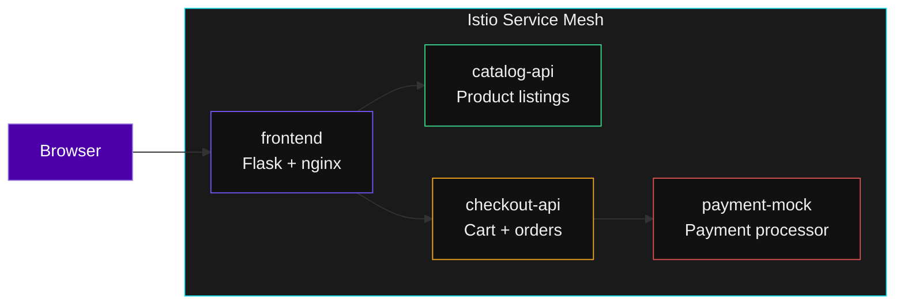
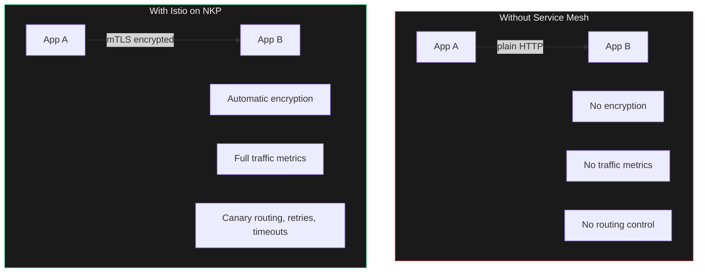

## What We Are Running

A real microservices ecommerce application is running on this cluster right now. This is the kind of workload your customers would run on NKP.



Every pod has an **Istio sidecar** -- a proxy that intercepts all traffic. Zero code changes required. The mesh provides mTLS encryption, traffic routing, and full observability automatically.

---

## Exercise -- See the Running Services

```terminal:execute
command: kubectl get pods -n demo-app 2>/dev/null || echo "Demo app namespace will be deployed by the facilitator"
```

```terminal:execute
command: kubectl get svc -n demo-app 2>/dev/null || echo "Services will appear when the demo app is deployed"
```

**What happened?** Each service has its own deployment and service object. Kubernetes handles service discovery -- `frontend` finds `catalog-api` by DNS name, not by IP address.

---

## The Four Services

| Service | Role | Why It Matters |
|---------|------|---------------|
| **frontend** | Browser-facing UI | Calls other services -- shows service-to-service communication |
| **catalog-api** | Product listings | Stateless microservice -- scales horizontally |
| **checkout-api** | Cart and orders | Calls payment-mock -- creates a dependency chain |
| **payment-mock** | Simulated payments | Has v1 and v2 -- used for canary deployment demo |

---

## What Istio Adds (Zero Code Changes)



> **The pitch to customers**: "Your developers write the same code. The mesh adds encryption, observability, and traffic control as infrastructure -- not application changes."
