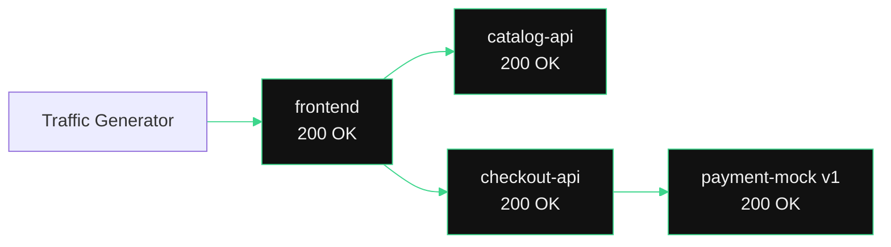
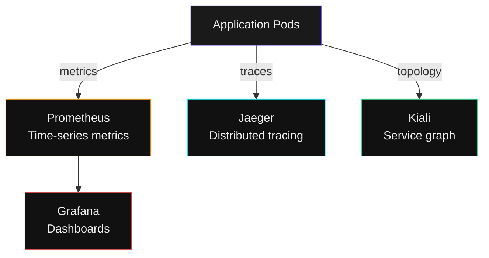

## See Traffic Flowing

Kiali is the service mesh observability UI. It shows **live** service-to-service traffic as a graph.

> **Facilitator will project Kiali.** Follow along in your terminal.

---

## Exercise -- Check Service Endpoints

```terminal:execute
command: kubectl get endpoints -n demo-app 2>/dev/null | head -10 || echo "Demo app endpoints will appear when deployed"
```

**What happened?** Each service has endpoints -- the actual pod IPs that receive traffic. Kubernetes and Istio route requests to these endpoints automatically.

---

## What Kiali Shows



**Green edges** = healthy traffic. Every arrow shows request rate, success rate, and latency. You see the entire application topology at a glance -- no log parsing required.

---

## Exercise -- Inspect Istio Sidecars

```terminal:execute
command: kubectl get pods -n demo-app -o jsonpath='{range .items[*]}{.metadata.name}{"\t"}{range .spec.containers[*]}{.name}{" "}{end}{"\n"}{end}' 2>/dev/null || echo "Demo pods will show sidecar containers when deployed"
```

**What happened?** Each pod has TWO containers: the application and `istio-proxy`. The proxy intercepts all inbound and outbound traffic -- that is how Kiali gets its data without any application instrumentation.

---

## The Observability Stack



All of this is included in NKP via the App Catalog. No manual installation. No configuration. Deploy, enable, done.

> **For customers**: "When something breaks at 2 AM, your on-call engineer opens Kiali, sees the red edge, clicks it, and knows which service is failing -- in seconds, not hours."
