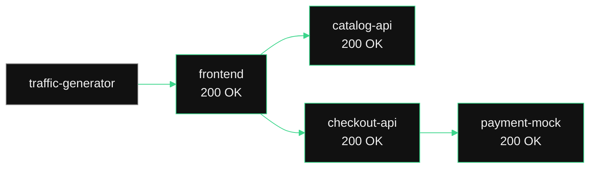
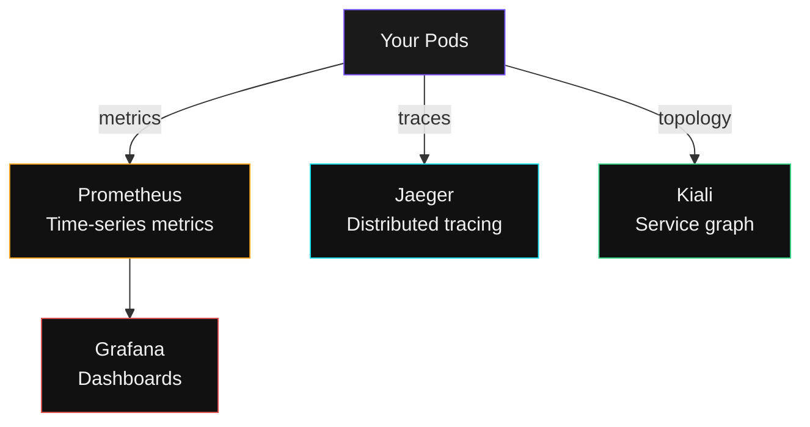

## Your Live Service Graph

Kiali is the service mesh observability UI. It shows **your** service-to-service traffic as a live graph -- no log parsing, no guessing.

---

## Exercise -- Open Your Kiali Dashboard

Click below to open Kiali filtered to your namespace:

```terminal:execute
command: echo "Open this URL in a new browser tab:" && echo "https://kiali.10.38.217.22.nip.io/kiali/?namespaces=$SESSION_NAMESPACE"
```

> **Note**: If your browser shows a certificate warning, click **Advanced** → **Proceed**. This is the same self-signed certificate used for the workshop.

---

## What You Should See



**Green edges** = healthy traffic. Every arrow shows request rate, success rate, and latency. You see the entire application topology at a glance.

---

## Exercise -- Verify Traffic Flow

Back in your terminal, confirm the services are communicating:

```terminal:execute
command: kubectl exec -n $SESSION_NAMESPACE deploy/frontend-v1 -c app -- wget -q -O- http://catalog-api/api/products 2>/dev/null | head -c 200
```

**What happened?** The frontend pod called the catalog-api service by DNS name. Kubernetes service discovery handled the routing. The Istio proxy intercepted the call, added mTLS encryption, and recorded metrics -- all invisible to the application.

---

## The Observability Stack



All of this is available on NKP. Deploy, enable, done.

> **For customers**: "When something breaks at 2 AM, your on-call engineer opens Kiali, sees the red edge, clicks it, and knows which service is failing -- in seconds, not hours."
