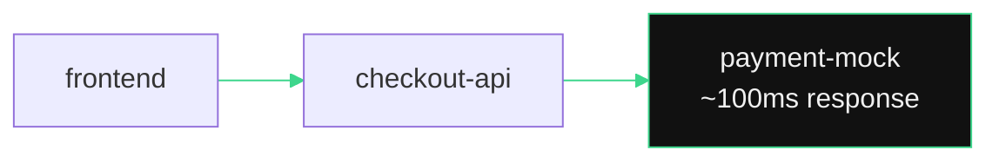
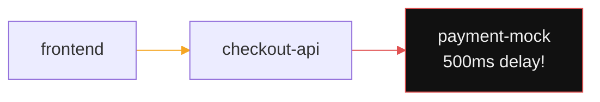
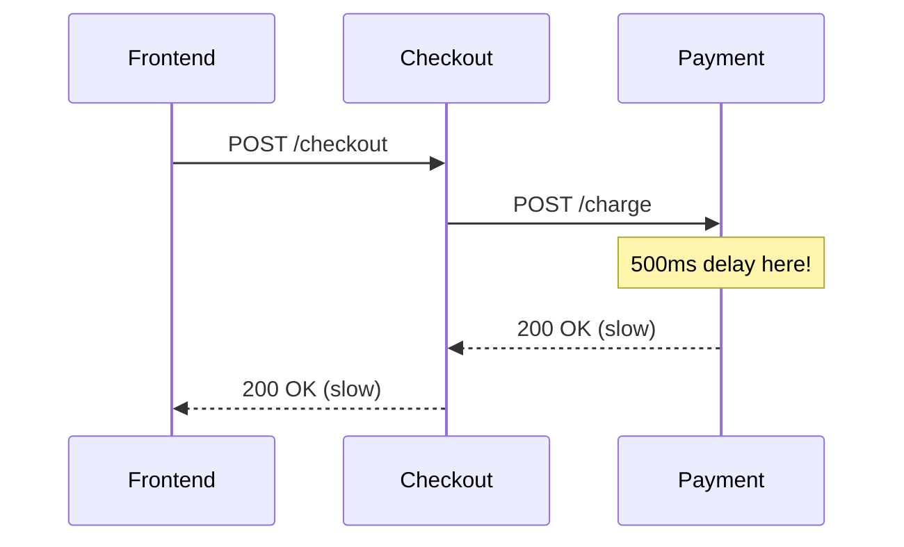

## You Are the On-Call Engineer

Something is about to go wrong with your payment service. You will inject a fault, watch the service graph change, trace the problem, and fix it -- all in under 2 minutes.

---

## Before the Incident

Your traffic generator is calling `frontend → catalog-api` and `checkout-api → payment-mock`. Everything should be fast and healthy.



---

## Exercise -- Break the Payment Service

This command patches the payment-mock deployment to add 500ms of artificial latency. It simulates a bad deploy -- a developer pushed a slow version.

```terminal:execute
command: kubectl patch deploy payment-mock-v1 -n $(session_namespace) --patch-file exercises/fault-injection.yaml
```

```terminal:execute
command: kubectl rollout status deploy/payment-mock-v1 -n $(session_namespace) --timeout=30s
```

**What happened?** You changed an environment variable (`FAIL_MODE=latency`) on the payment-mock deployment. Kubernetes rolled out a new pod with the slow configuration. No code change -- just a config update, exactly like a real incident.

---

## Exercise -- Watch It Go Red in Kiali

Switch to your Kiali browser tab and wait 15-20 seconds:



The `checkout-api → payment-mock` edge should show increased latency. The mesh detects the slowdown automatically.

---

## Exercise -- Measure the Damage

```terminal:execute
command: kubectl exec -n $(session_namespace) deploy/checkout-api-v1 -c app -- python3 -c "import urllib.request, time, json; req=urllib.request.Request('http://payment-mock/charge', data=json.dumps({'order_id':'test'}).encode(), headers={'Content-Type':'application/json'}, method='POST'); start=time.time(); r=urllib.request.urlopen(req); print(f'Response time: {(time.time()-start)*1000:.0f}ms - Status: {r.status}')"
```

**What happened?** The checkout service now takes 500ms+ to get a response from payment-mock. In production, this cascading latency would slow down every checkout for every customer.

---

## Exercise -- Find It in Jaeger

Open Jaeger to see the exact span where the latency lives:

```terminal:execute
command: echo "Open this URL in a new browser tab:" && echo "https://jaeger.10.38.217.22.nip.io/search?service=checkout-api.$(session_namespace)"
```



Click on a trace and expand the spans. The 500ms delay on `payment-mock` is immediately visible.

---

## Exercise -- Fix It

Remove the latency by patching the deployment back to normal:

```terminal:execute
command: kubectl patch deploy payment-mock-v1 -n $(session_namespace) --patch-file exercises/fault-fix.yaml
```

```terminal:execute
command: kubectl rollout status deploy/payment-mock-v1 -n $(session_namespace) --timeout=30s
```

Switch back to Kiali. Within 30 seconds, latency drops back to normal.

---

## Exercise -- Verify the Fix

```terminal:execute
command: kubectl exec -n $(session_namespace) deploy/checkout-api-v1 -c app -- python3 -c "import urllib.request, time, json; req=urllib.request.Request('http://payment-mock/charge', data=json.dumps({'order_id':'test'}).encode(), headers={'Content-Type':'application/json'}, method='POST'); start=time.time(); r=urllib.request.urlopen(req); print(f'Response time: {(time.time()-start)*1000:.0f}ms - Status: {r.status}')"
```

**What happened?** Response time is back to normal. The "fix" was reverting the config change -- exactly like a `git revert` in a real GitOps workflow.

---

## Exercise -- Scale Under Load

What if this service needs to handle more traffic? Scale it up with one command:

```terminal:execute
command: kubectl scale deploy frontend-v1 -n $(session_namespace) --replicas=3
```

```terminal:execute
command: kubectl get pods -n $(session_namespace) -l app=frontend -w
```

**What happened?** Kubernetes spun up 2 more frontend pods in seconds. Each new pod automatically got an Istio sidecar -- zero additional configuration. Press `Ctrl+C` when all pods show `2/2 Running`.

```terminal:execute
command: kubectl scale deploy frontend-v1 -n $(session_namespace) --replicas=1
```

> **The pitch**: "Scaling is one command. The mesh, the monitoring, the encryption -- it all follows automatically. No tickets, no config files, no waiting."

---

## The Takeaway

> **This is the story to tell your customers**: "A bad config was deployed. The platform detected the latency in seconds. The on-call engineer saw the slow service in Kiali, traced it in Jaeger, and reverted the config. Total time to resolution: minutes, not hours. No log parsing. No guessing."
