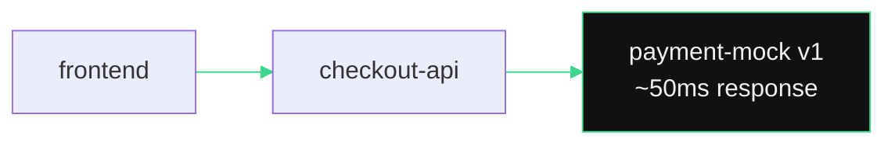
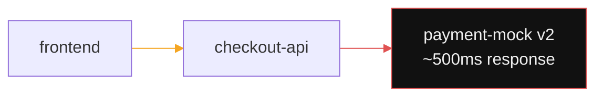
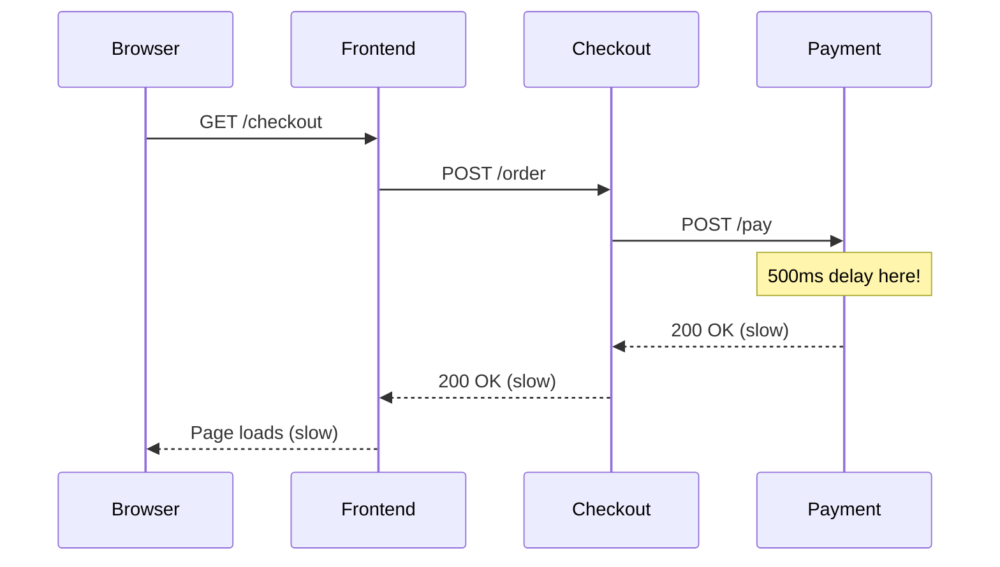

## What Is About to Happen

Your facilitator will trigger a latency incident on the `payment-mock` service. A slow version gets deployed via GitOps -- no manual changes on the cluster. Watch what happens.

---

## Before the Incident



Everything is green. Response times are fast. No alerts.

## After the Incident



**Only the `checkout-api -> payment-mock` edge turns red.** Every other edge stays green. The mesh tells you exactly where the problem is before anyone opens a log file.

---

## Exercise -- Check Running Pods

```terminal:execute
command: kubectl get pods -n demo-app -l app=payment-mock 2>/dev/null || echo "Payment mock pods will be visible when demo app is deployed"
```

**What happened?** Both v1 and v2 of payment-mock may be running. The incident scenario routes traffic to v2 (the slow version) using Istio traffic routing -- no code changes, just a config update.

---

## Finding the Root Cause with Jaeger

> **Facilitator shows**: Jaeger distributed tracing UI



Jaeger shows the **exact span** where the latency lives. Click on a trace, expand the spans, and the 500ms delay on `payment-mock` is immediately visible.

---

## Exercise -- Check Service Response Times

```terminal:execute
command: kubectl top pods -n demo-app 2>/dev/null || echo "Metrics server may not be available -- use Grafana dashboards for resource metrics"
```

---

## The Demo Takeaway

> **This is the story to tell customers**: "A developer pushed a bad version. The service mesh detected the latency in seconds. The on-call engineer saw the exact failing service in Kiali, traced it in Jaeger, and rolled back with a Git revert. Total time to resolution: minutes, not hours. No log parsing. No guessing."
