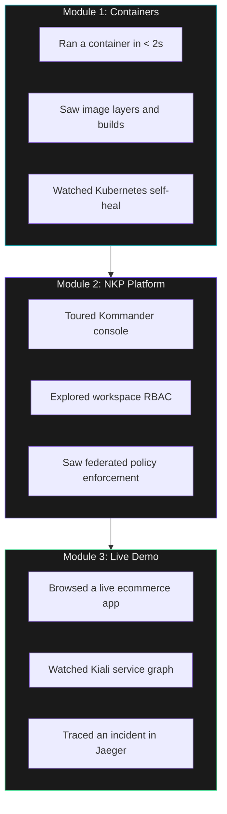

## What You Covered



---

## The Partner Opportunity

Your customers are running VMs on Nutanix today. The path to containers runs through the **same infrastructure** -- no rip and replace.

| Customer Need | NKP Answer |
|--------------|------------|
| "We need Kubernetes" | NKP: upstream K8s, fully supported |
| "We need multi-cluster management" | Kommander: single pane of glass |
| "We need observability" | App Catalog: Grafana, Prometheus, Kiali, Jaeger |
| "We need security and compliance" | Workspace RBAC + Kyverno policies |
| "We need to use our existing storage" | Nutanix CSI: native integration |

> **The pitch is not "replace your VMs." The pitch is: "Add NKP to what you already have, and your customers get the platform their developers are asking for -- without changing infrastructure."**

---

## Try More Yourself

Your terminal is still active. Explore:

```terminal:execute
command: kubectl get namespaces
```

```terminal:execute
command: kubectl get pods -A --no-headers | wc -l
```

```terminal:execute
command: kubectl cluster-info
```

---

## Next Steps

- **Full hands-on workshops**: Ask your facilitator about the 4-hour developer and infrastructure tracks
- **Deployment prerequisites**: vSphere/AHV requirements, sizing calculator, network planning
- **Partner resources**: Demo kits, competitive positioning, customer pitch decks
- **Lab access**: This environment stays available for the rest of the day -- keep exploring

> **Thank you for attending!** Questions? Grab your facilitator.
